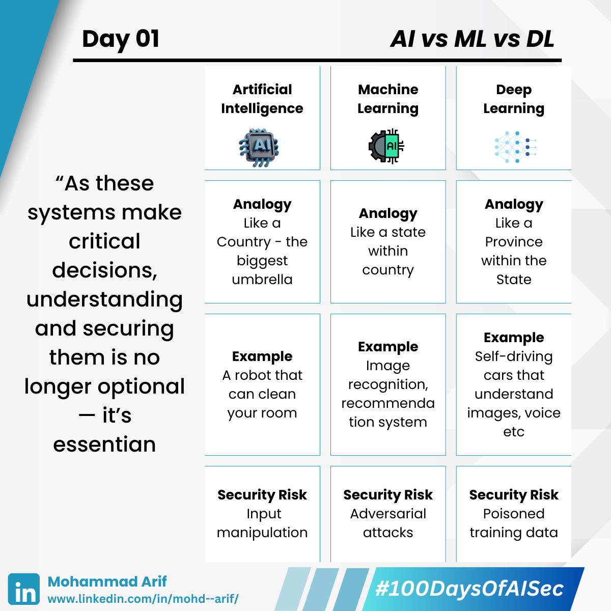

# Day 1

---
description: AI vs ML vs DL — And Why It Matters for Security
---

Today, I explored the differences between **Artificial Intelligence (AI)**, **Machine Learning (ML)**, and **Deep Learning (DL)** — terms often used interchangeably, but each has its own level of depth and scope.

---

## 🔁 Analogy to Simplify It

### **AI is like a Country**

- It’s the broadest concept — enabling machines to mimic human intelligence.  
- **Example**: A robot that can clean your room by understanding voice commands and navigating space.

### **ML is like a State within that Country**

- A subset of AI where machines learn from data to make predictions/decisions without being explicitly programmed.  
- **Example**: Image recognition, recommendation systems.

### **DL is like a Province within that State**

- A specialized type of Machine Learning that mimics how the human brain works — using layers of “neurons” to learn from complex data like images, sounds, or videos.  
- **Example**: Self-driving cars that understand images, voice, etc.

> They're not separate technologies — they're nested within each other.

---

## 🔒 Looking Through a Security Lens

These technologies don’t just power amazing innovations — they also open up **new attack surfaces**:

- **AI – Input Manipulation**  
  If someone gives confusing or malicious voice commands, the robot may malfunction or perform incorrect actions.

- **ML – Adversarial Attacks**  
  A slightly altered image could fool the model into misclassifying (e.g., a cat image classified as a dog).

- **DL – Poisoned Training Data**  
  If attackers inject bad data, the model may learn incorrect behavior (e.g., ignore stop signs).  
  👉 *Interesting*: DL models are often “black boxes,” making failures hard to diagnose or fix.

As these systems make critical decisions, understanding and **securing them is no longer optional — it’s essential**.

---

I'm starting from scratch — but by **Day 100**, I aim to become a **Subject Matter Expert in AI/ML Security**.

📢 **Follow along**, share your favorite resources, or drop ideas below. I’m all ears!

---

## 📚 Resources

- [Resource 1](https://lnkd.in/gh6NNVQf)  
- [Resource 2](https://lnkd.in/gj3v753e)  
- [Resource 3](https://lnkd.in/g3gDtc8j)

---

**Day 1/100 — Beginning My #100DaysOfAISec Journey**
