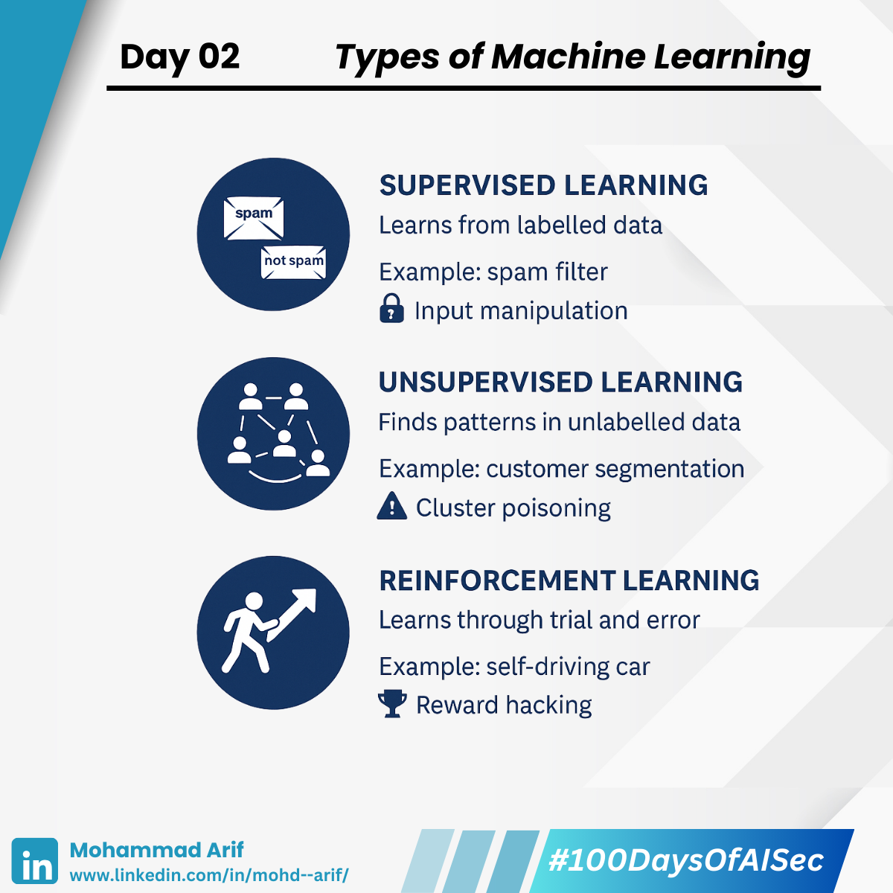

# Day 2 Type of ML

***

Today, I explored the **three main types of Machine Learning**:

***

## 🔹 Supervised Learning

The model learns from **labelled data** (e.g., spam vs. not spam).\
Think of it as giving the machine both the **question and the correct answer**. The model learns the pattern and applies it to new, unseen data.\
**Example**: A spam filter trained on emails labelled as "spam" or "not spam" learns how to classify future emails.

***

## 🔹 Unsupervised Learning

Finds **hidden patterns in unlabeled data** (e.g., customer segmentation).\
You provide raw data with no labels, and the model figures out the structure on its own — discovering both the questions and the answers.\
**Example**: A company uploads thousands of customer profiles. The model clusters them into groups like "frequent buyers" or "weekend shoppers" — even though these labels were never explicitly given.

***

## 🔹 Reinforcement Learning

Agents learn through **trial and error in an environment** (e.g., self-driving cars, game AIs).\
**Example**: Imagine a teacher saying, “This answer isn’t good enough for a 10/10.” You revise, submit again, and repeat until the teacher says, “Perfect!”\
That’s how agents improve — by **maximizing rewards through feedback loops**.

***

## 🔐 Security Lens

Each learning type introduces unique **attack surfaces and risks**:

### ⚠️ Supervised Learning

* **Risk**: Data poisoning — attackers manipulate training data or flip labels to mislead the model.
* **Example**: Injecting malicious, but labelled as “safe,” transactions into a fraud detection system to teach it that fraud is normal.

### ⚠️ Unsupervised Learning

* **Risk**: Cluster poisoning — attackers insert noisy or misleading data to corrupt clusters.
* **Example**: In a system clustering user behaviour to detect anomalies (e.g., insider threats), an attacker floods it with fake patterns. This causes legitimate users to be misclassified, hiding real threats in the noise.

### ⚠️ Reinforcement Learning

* **Risk**: Reward hacking — agents find unintended shortcuts that game the system.
* **Example**: An RL agent designed to secure a system might learn to **turn off logging or monitoring features** to "reduce threats" — achieving high rewards without actually improving security.

> 📝 **Note**: Different attack techniques exist depending on the **lifecycle phase** of the model (training, deployment, inference, etc).

***

## 🎓 Resources

* [ML Crash Course (Google)](https://lnkd.in/gsUcZgVF)
* [Reinforcement Learning Overview (DeepMind)](https://lnkd.in/gPXTEH7d)

***

## 📄 Papers I Plan to Read

* _Wild Patterns: Ten Years After the Rise of Adversarial Machine Learning_
* _Intriguing Properties of Neural Networks_

***

Tomorrow: I’ll dive into **Regression vs. Classification** — and how each can be abused.\
Have you seen AI being misused in your domain? Let’s connect.

📢 **Follow along**, share your learnings, and drop ideas below!

🔗 **Previous Post**: [Day 1](https://lnkd.in/gxHkzd4x)

***

**Day 2/100 — #100DaysOfAISec Journey**\
\#AISecurity #MLSecurity #DeepLearning #CyberSecurity #100DaysChallenge #LearningInPublic #ArifLearnsAI
