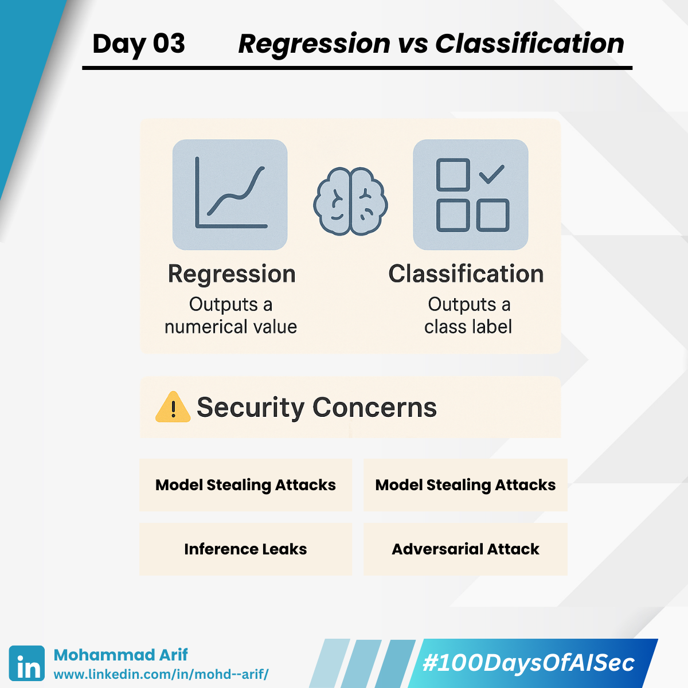

# Day 3 Regression vs Classification

***

Today I learned the core difference between the two foundational ML problems:

***

## 🔹 Regression

The model provides an output in **numerical form**.\
**Example**: You may want to predict how temperature changes as a plane gains altitude.

***

## 🔹 Classification

The model predicts which **category** the input belongs to (e.g., spam vs. not spam, fraud vs. legitimate).\
**Example**: The model predicts whether it's **safe or unsafe** to fly based on weather conditions.

These two problem types form the **backbone of most real-world AI systems** — and attackers know exactly how to exploit them.

***

## 🔐 Security Lens

### ⚠️ Classification Models

* **Model Stealing Attacks**\
  Attackers send many inputs (emails, images, etc.) to a model's API and collect the output labels.\
  They then train their own model using this data to replicate the original model’s behaviour — even without access to the original algorithm or training data.
* **Adversarial Attacks**\
  Especially dangerous in **image/text classification**.\
  **Think**: Stop signs tricking self-driving cars into interpreting them as speed limit signs.

***

### ⚠️ Regression Models

* **Model Stealing Attacks**\
  These are often **easier to reverse-engineer**, because the outputs are **detailed numerical values** rather than simple categories.\
  **Example**: If a model returns "$357,200" instead of just "expensive," an attacker can more accurately reconstruct the model’s decision boundaries.
* **Inference Leaks**\
  An attacker inputs specific data points into the model and observes the **confidence level** of the output.\
  If the model shows **high confidence**, it may suggest that the input was seen during training — a sign of **membership inference leak**.

> 💡 **Example**: A salary prediction model unintentionally exposing real people’s salaries.\
> (This is especially relevant in deep learning tasks, where inputs are **context- and attribute-rich**.)

> 📝 _Note_: I refined the previous inference explanation to remove ambiguity.

***

## 📚 References

* _(2014)_ [Explaining and Harnessing Adversarial Examples](https://arxiv.org/abs/1412.6572)
* _(2016)_ [Stealing Machine Learning Models via Prediction APIs](https://arxiv.org/abs/1609.02943)
* [PortSwigger Blog on ML Attacks](https://lnkd.in/gfJB8vEc)
* [Linear Regression blog by Aditya Bharathi](https://lnkd.in/gtSpkN7T)

***

## 💬 Question

What are some **misclassification risks** you've seen in your industry (e.g., fraud, content filters, medical predictions)?

***

📅 **Tomorrow**: Exploring **Overfitting & Underfitting** — and how **memorization leads to leakage**.

📢 Follow along, share your favourite resources, or drop ideas below — I’m all ears!

🔗 **Previous Post**: [Day 2](https://lnkd.in/dmq6C8px)

***

**Day 3/100 — Beginning My #100DaysOfAISec Journey**\
\#AISecurity #MLSecurity #DeepLearning #CyberSecurity #100DaysChallenge #LearningInPublic #ArifLearnsAI
