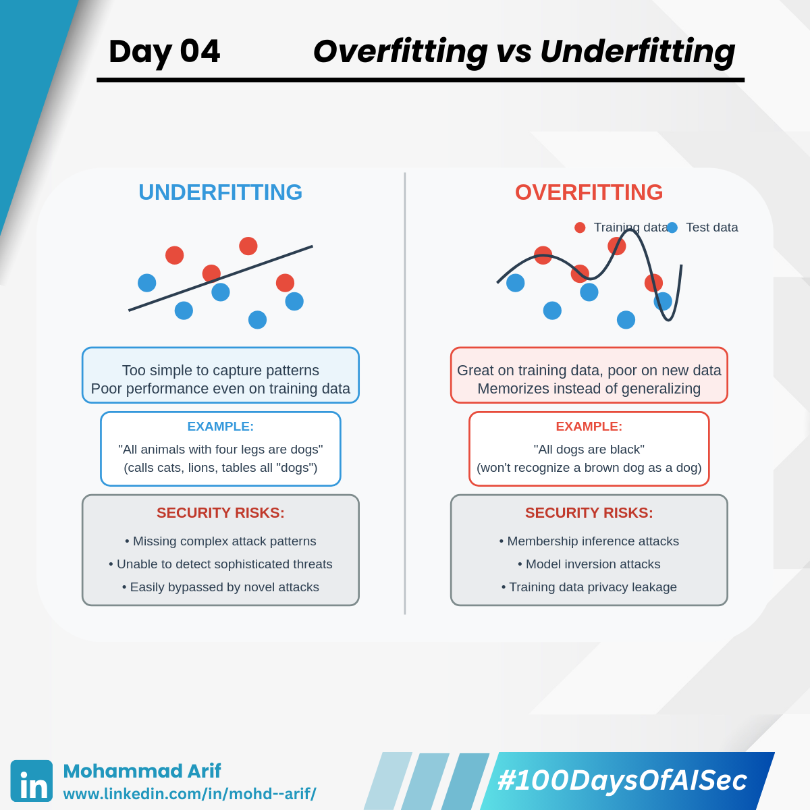

# Day 4 Overfitting vs Underfitting

***

Today I explored two core ML concepts that every AI system struggles with:

***

## 🔹 Overfitting

When a model performs great on **training data** but poorly on **real-world data** (it “memorizes” instead of generalizing).\
**Example**: A kid sees only black dogs during training and learns "All dogs are black."\
Now when shown a brown dog, he says, "That’s not a dog."\
He memorized, didn’t generalize.

***

## 🔹 Underfitting

When a model is **too simple** to capture patterns — it performs poorly **even on training data**.\
**Example**: Another kid is told, "Animals with four legs are dogs."\
Now he calls a cat, a lion, even a table — a dog.\
He didn’t learn enough details.

These aren’t just training challenges — they have **real security consequences** if ignored.

***

## 🔐 Security Lens

### ⚠️ Overfitting Risks

* **Membership Inference Attacks**\
  If a model memorizes its training data, attackers can probe it to find out whether a **specific datapoint** was used — a major **privacy risk** in sectors like healthcare or finance.\
  **Example**: A model trained on real patient data might react slightly differently if you ask, “Was John Doe’s tumor data in your training set?”\
  This helps an attacker **confirm the presence of sensitive data**.
* **Model Inversion**\
  Overfitted models can **leak internal data characteristics**.\
  Attackers can use output scores to **reconstruct** sensitive input features.\
  **Example**: A facial recognition model trained on private ID photos can be queried repeatedly.\
  The attacker may eventually synthesize a **lookalike face** from training data — even without seeing the original image.

> 🧠 It’s like asking enough yes/no questions about a secret photo until you can draw a disturbingly accurate replica.\
> Scary, right?

***

### ⚠️ Underfitting Risks

* **Missed Edge Cases**\
  Underfit models are **too simple** to capture rare or abnormal patterns — a critical issue in **security**, where attackers often behave abnormally.\
  **Example**: An anti-fraud model might miss a **low-volume, high-value scam** if it never learned the subtle patterns behind it.

***

## 📚 References

* _Shokri et al., 2017_ – Membership Inference Attacks Against Machine Learning Models
* [Blog by Kush](https://lnkd.in/d3fjc4pE)
* [ML Overfitting & Privacy - LinkedIn Article](https://lnkd.in/dyRdANmU)

***

## 💬 Question

How do you **balance accuracy vs. privacy** in ML models at your company?

***

📅 **Tomorrow**: I’ll dig into **Decision Trees and Random Forests** — and why **randomness is good** 🎲

🔗 **Previous Post**: [Day 3](https://lnkd.in/dF6N_Da9)

***

**Day 4/100 — Beginning My #100DaysOfAISec Journey**\
\#AISecurity #MLSecurity #DeepLearning #CyberSecurity #100DaysChallenge #LearningInPublic #ArifLearnsAI
