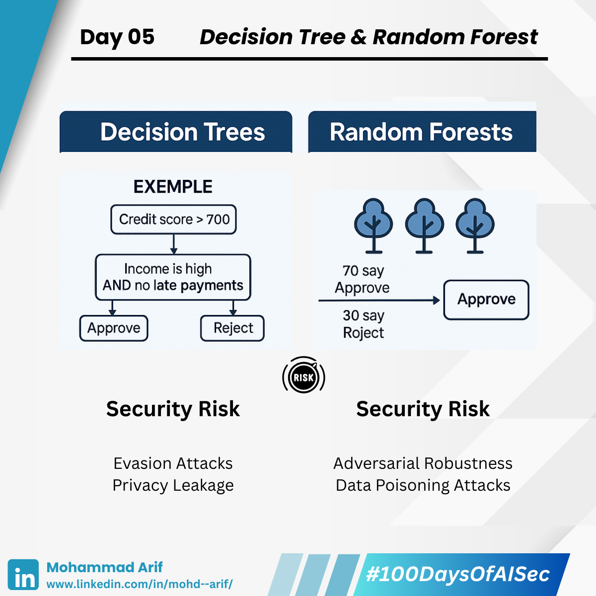

# Day 5 Decision Tree & Random Forest

***

Today, I explored two classic ML algorithms that are **surprisingly interpretable — and surprisingly vulnerable** 👀

***

## 🔹 Decision Trees

Think of them like "if-then" **flowcharts**.\
They split data step by step:

👉 If credit score > 700 → Approve loan\
👉 Else if income is high & no late payments → Approve\
👉 Else → Reject

It’s a **checklist-style** model — easy to understand, easy to debug.

***

## 🔹 Random Forests

Now imagine a **forest of decision trees**.\
Each tree sees a slightly different view of the data and gives its vote.

Out of 100 trees:\
🗳 70 say “Approve”, 30 say “Reject”\
✅ Final answer? Approve.

The **majority wins** — leading to better accuracy & reduced bias.

***

## 🔐 Security Lens

### ⚠️ Decision Tree Risks

* **Evasion Attacks** – Tiny input tweaks can change the outcome.\
  📌 A spammer adjusts a few words slightly to bypass a spam filter — and it works.
* **Privacy Leakage** – Trees can **memorize sensitive training data**.\
  📌 A medical model might reveal symptom patterns tied to real patients.

***

### ⚠️ Random Forest Risks

* **Adversarial Examples** – Even with many trees, crafted inputs can slip through.\
  📌 A malware sample crafted to fool all trees might evade detection entirely.
* **Data Poisoning** – If attackers poison the training data, the entire forest learns **wrongly**.\
  📌 Injecting fake “benign” malware during training teaches the model to trust real threats.

***

## 📚 References

• Kantchelian et al., 2016 – _Evasion Attacks on Decision Trees_\
• Biggio et al., 2018 – _Poisoning Attacks on Random Forests_\
• Yeom et al., 2019 – _Privacy Risks in Tree Models_\
• [Bonus Read: Demystifying Decision Trees – SapienceSpace](https://lnkd.in/dnHKFJsG)

***

## 💬 Question

How do you **secure your ML models** from evasion or poisoning?

***

📅 **Tomorrow**: I’ll explore **Boosting** — and why making your model “stronger” might also make it **fragile** ⚠️

🔗 **Missed Day 4?** [Click here](https://lnkd.in/dW34C7cT)

***

**#100DaysOfAISec – Day 5 Post**\
\#AISecurity #MLSecurity #DecisionTrees #CyberSecurity #AIPrivacy #AdversarialML #LearningInPublic #100DaysChallenge #ArifLearnsAI #LinkedInTech
