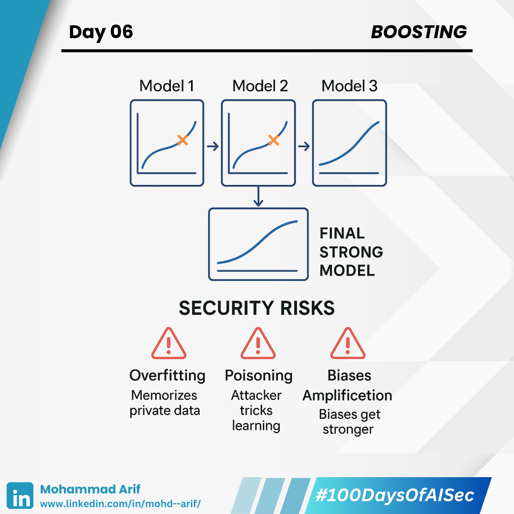

# Day 6 Boosting

***

Today I explored **Boosting** — an ensemble method that builds strong models by **sequentially learning from the mistakes of weak ones**.

***

## 🔹 Quick Primer on Boosting

* Models are trained **one after another**, each correcting the last one’s errors
* Great for **high accuracy**, especially on structured/tabular data
* Unlike Random Forests, Boosting is **sequential**, not parallel

It’s like a tutor giving more attention to mistakes in each lesson — powerful, but risky when manipulated.

***

## 🔐 Security Lens

### ⚠️ Overfitting Risks

When boosting goes too far, it **memorizes data**, including sensitive details — a major privacy concern.\
📌 Like a student who memorizes exact answers without understanding — it breaks down on new questions.

***

### ⚠️ Model Poisoning

An attacker introduces **crafted bad data** early in training.\
Boosting will over-focus on these errors — essentially learning **the wrong things**.\
📌 Think of a student being repeatedly told incorrect answers… and then teaching others.

***

### ⚠️ Bias Amplification

If early training data is **biased**, boosting **amplifies** the bias across later rounds.\
📌 Garbage in, garbage magnified out.

Boosting is like a smart, focused teacher — but if you give it the wrong textbook, it’ll still master it.

***

## 📚 Key References

* Jagielski et al. (2018): _Manipulating Machine Learning via Poisoning Attacks_
* [MIT OpenCourseWare: Boosting (Video)](https://lnkd.in/gcdmEDpT)

***

## 💬 Question

Have you ever seen model predictions behave strangely because of **boosting**?\
Let’s swap stories 👇

***

📅 **Tomorrow**: I’ll explore **Loss Functions** — how models “learn,” and how choosing the wrong one can create risky behavior.

🔗 **Missed Day 5?** [Click here](https://lnkd.in/gwP4u_9Z)

***

**#100DaysOfAISec – Day 6 Post**\
\#AISecurity #MLSecurity #DecisionTrees #CyberSecurity #AIPrivacy #AdversarialML #LearningInPublic #100DaysChallenge #ArifLearnsAI #LinkedInTech
