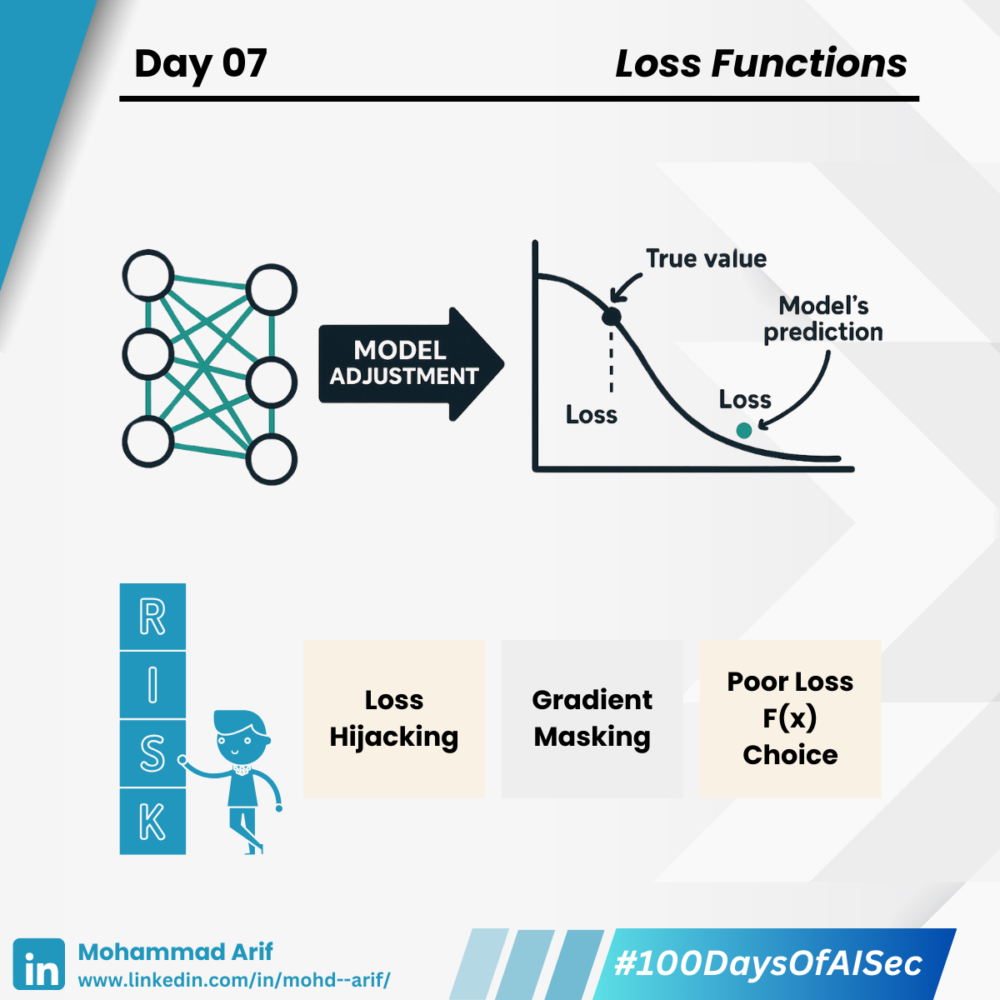

# Day 7 Loss Functions

***

Today I explored **Loss Functions** — the core ingredient that tells a machine learning model how “wrong” it is, and how to improve.

***

## 🔹 Quick Primer

* A **loss function** measures the gap between predicted and true values
* The goal of training is to **minimize this loss**
* Models update their internal weights based on the loss to get closer to the truth

🧠 Think of a loss function as the **moral compass** of a model — but a poorly chosen or manipulated one can send it in the wrong direction.

***

## 🔐 Security Lens: How Loss Functions Can Be Attacked

### ⚠️ Loss Hijacking

Attackers subtly poison the training data so the **loss function rewards the wrong behavior**.

🦴 _Analogy:_ You're training a dog to sit, giving treats. But someone gives treats when it jumps instead.\
Now the dog thinks **jumping is “correct”** — same with your model.

***

### ⚠️ Gradient Masking

Some defences modify loss functions to hide gradients — but attackers often find ways around them.

🧭 _Analogy:_ You’re playing “hot and cold” to find treasure.\
Normally, “hot” means you’re close. But now someone fakes the sound.\
You keep hearing “hot” even when far — **you’re misled into thinking you're doing well**.

***

### ⚠️ Poor Loss Choices

Choosing the **wrong loss function** makes the model optimize the **wrong thing**.

🌶️ _Analogy:_ You judge recipes only by how spicy they are, ignoring taste or balance.\
You’ll end up with a dish that's **all spice, no flavor** — a model good at the wrong goal.

***

## 📚 Key References

* Goodfellow et al. (2014): _Explaining and Harnessing Adversarial Examples_
* Carlini & Wagner (2017): _Towards Evaluating the Robustness of Neural Networks_
* [IBM Tech Blog: Loss Function Risks](https://lnkd.in/gk8pq2Hp)

***

## 💬 Question for You

**What’s the strangest model failure** you’ve seen because of a poorly chosen loss function?\
Let’s discuss 👇

***

📅 **Up Next**: We dive into **Gradient Descent** — how models “walk downhill” to find better answers 🔽

🔗 **Missed Day 6?** [Catch up here](https://lnkd.in/gsMYGXwr)

***

**#100DaysOfAISec – Day 7 Post**\
\#AISecurity #MLSecurity #MachineLearningSecurity #LossFunctions #CyberSecurity #AIPrivacy #AdversarialML #LearningInPublic #100DaysChallenge #ArifLearnsAI #LinkedInTech
