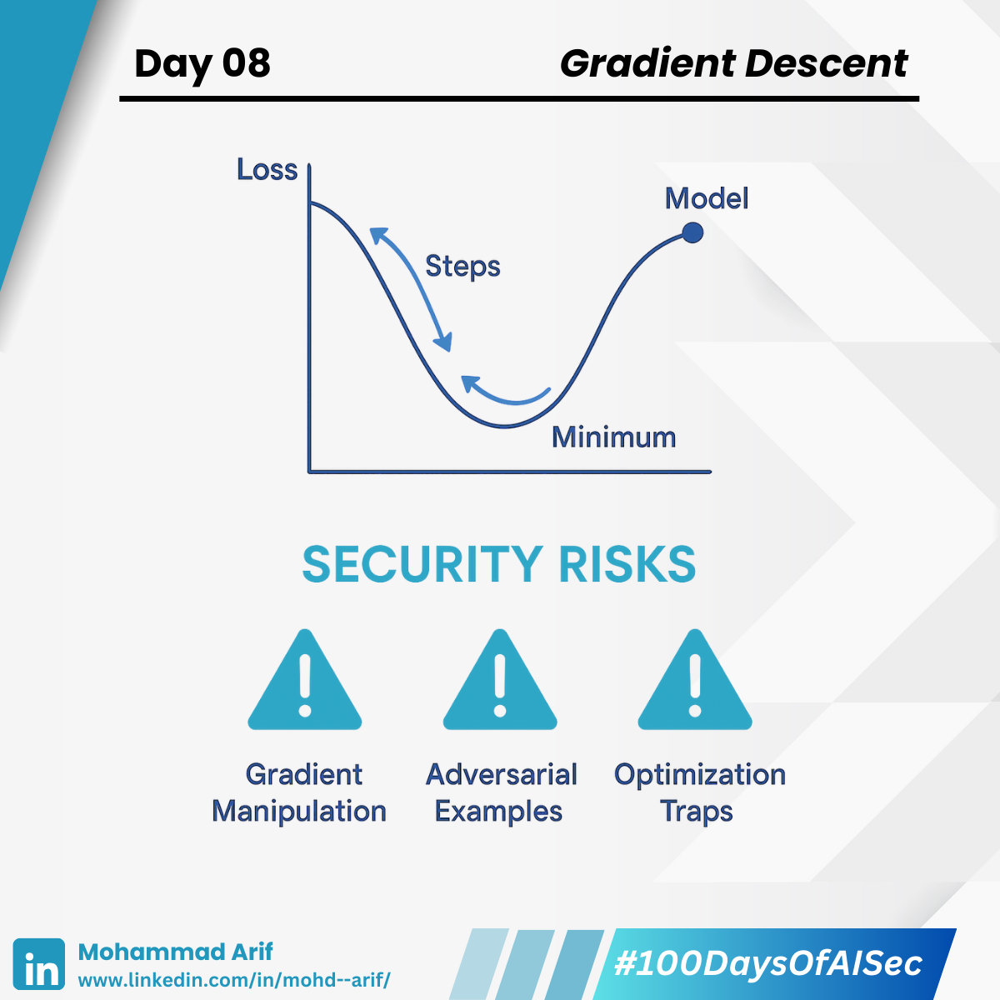

# Day 8 Gradient Descent

***

What if I told you almost every AI model is just trying to **roll down a hill without slipping**? ⚡

Welcome to **Gradient Descent** — the powerful algorithm behind how machines learn.

***

## 🔹 What is Gradient Descent?

Gradient Descent helps models find the lowest point on a loss curve — i.e., **minimum error** — by taking small, calculated steps downhill.

🧭 It’s like hiking down a foggy, bumpy trail:

* The slope tells you which direction to step
* Each step adjusts the model’s weights
* The goal? Reach the valley of **minimum loss**

***

## 🔐 Security Lens: How Attackers Hijack the Learning Path

Gradient Descent may be smart — but attackers know how to poison the path. Here’s how:

### ⚠️ Misleading Road Signs (Gradient Manipulation)

📌 _Data poisoning_ makes the gradient point in the wrong direction — training the model to learn **wrong behaviors**.

> Think of fake road signs that send you off-course while hiking.

***

### ⚠️ Banana Peels on the Trail (Adversarial Examples)

📌 At test time, attackers add tiny changes to inputs that **don’t look wrong** — but cause major misclassifications.

> Like stepping on an invisible banana peel — you slip, even though the path looks fine.

***

### ⚠️ Fake Shortcuts and Hidden Traps (Optimization Traps)

📌 Attackers craft **malicious loss landscapes** to trap the model in **bad local minima**.

> You're tricked into thinking you’ve reached the valley — but it’s just a ditch.

***

## 📚 Key References

* Biggio et al. (2012): _Poisoning Attacks Against Support Vector Machines_
* Goodfellow et al. (2015): _Explaining and Harnessing Adversarial Examples_
* Jovian: [Gradient Descent Deep Dive](https://lnkd.in/g28hPX_3)
* Aditya Bharathi: [Security Perspectives](https://lnkd.in/gNV_pfRT)

***

## 💬 Question for You

**Have you battled frustrating optimization issues while training your models?**\
I’d love to hear your story 👇

***

📅 **Up Next**: How Neural Networks become brainy "universal approximators" — and why that’s a double-edged sword 🧠⚡

🔗 **Missed Day 7?** [Catch it here](https://lnkd.in/guKzZUMC)

***

**#100DaysOfAISec – Day 8 Post**\
\#AISecurity #MLSecurity #MachineLearningSecurity #GradientDescent #CyberSecurity #AIPrivacy #AdversarialML #LearningInPublic #100DaysChallenge #ArifLearnsAI #LinkedInTech
