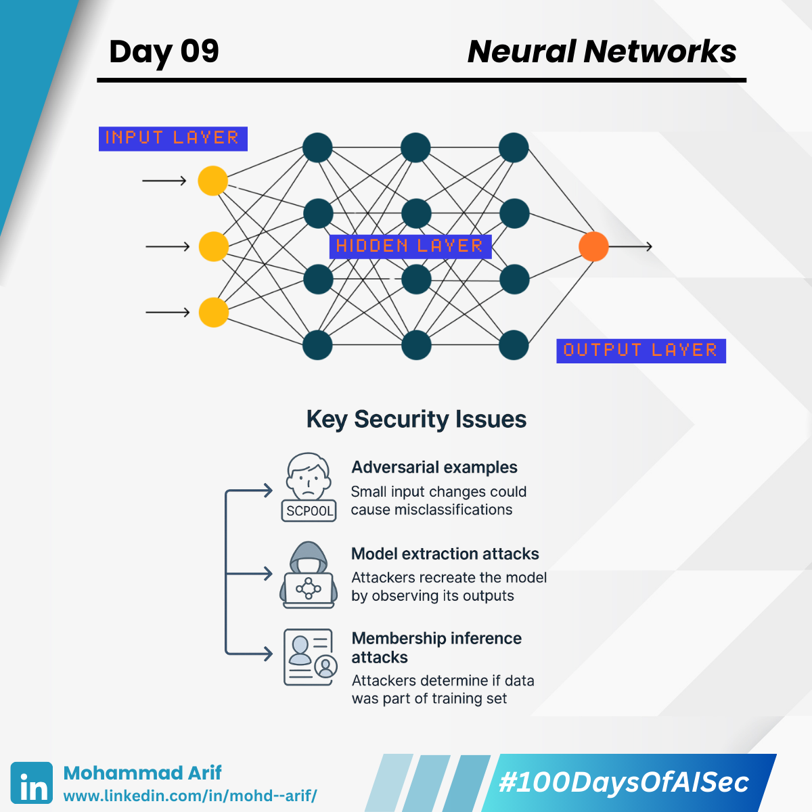

# Day 9 Neural Networks

***

Today I explored the marvel behind modern AI: **Neural Networks** — the architecture that powers everything from ChatGPT to self-driving cars 🚗✨

***

## 🔹 What Are Neural Networks?

Neural Networks are made up of layers of tiny, “dumb” units called **neurons** that pass information forward — like a massive game of telephone ☎️

They’re inspired by the human brain — but much simpler (and no coffee needed!).

### Key Components:

* 🟢 **Input Layer** — Receives raw data (images, text, signals)
* 🔵 **Hidden Layers** — Extract and combine patterns/features
* 🔴 **Output Layer** — Makes the final prediction or decision

👉 With enough neurons and training data, neural networks can **approximate any continuous function** — a superpower known as the **Universal Approximation Theorem**.

***

## 🔐 Security Lens: Neural Networks Can Be Leaky

Their power comes with pitfalls — here’s how attackers exploit them:

### ⚠️ Adversarial Examples

📌 _Microscopic changes_ to inputs can cause wild misclassifications.

> Think: Your friend sends you a selfie — just a little distorted, but your phone sees a giraffe 🦒

***

### ⚠️ Model Extraction Attacks

📌 Repeatedly querying a model can let attackers **reverse-engineer** its logic.

> Like watching someone type and guessing their password from screen reactions 🎯

***

### ⚠️ Membership Inference Attacks

📌 Attackers can tell if a **specific person’s data** was used in training.

> Imagine deducing if your shopping history helped train a product recommender 👀

***

## 📚 Key References

* Szegedy et al. (2013): _Intriguing Properties of Neural Networks_
* Gao et al. (2020): _Exploring the Limits of Model Extraction Attacks_
* 🎥 [3Blue1Brown — What is a Neural Network?](https://lnkd.in/gTgyjhzA)
* 📘 [SapienceSpace – Aditya Bharathi](https://lnkd.in/gUi_6WVK)

***

## 💬 Let’s Talk

**Have you ever thought about how leaky a black-box neural network can be?**\
Let’s discuss the risks of treating models like magic boxes 👇

***

📅 **Up Next**: Feature Engineering — how it shaped ML before deep learning and the hidden risks it still carries 🔍🔐

🔗 **Missed Day 8?** [Catch it here](https://lnkd.in/gmXau5GW)

***

**#100DaysOfAISec – Day 9 Post**\
\#AISecurity #MLSecurity #MachineLearningSecurity #NeuralNetworks #CyberSecurity #AIPrivacy #AdversarialML #LearningInPublic #100DaysChallenge #ArifLearnsAI #LinkedInTech
