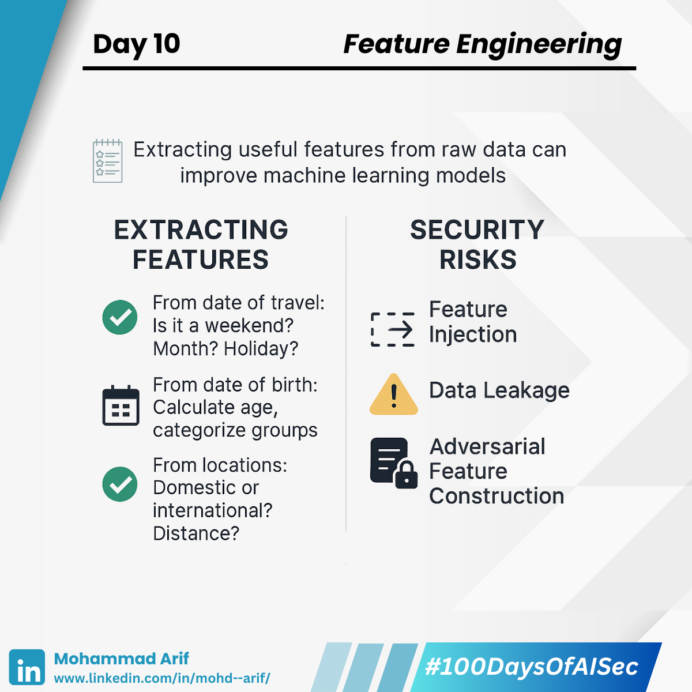

# Day 10: 
---
description: Feature Engineering — ML’s Secret Weapon (and Hidden Risk) 🛠️🔐
--- 

Today I explored **Feature Engineering** — the underrated superpower that can make or break your machine learning model 🚀

---

## 🎯 Why Feature Engineering Matters

Imagine you're building a travel ticket prediction model. Instead of feeding raw data, you *extract meaningful features*:

✅ From date of travel → Is it a weekend? Holiday season?  
✅ From date of birth → Calculate age or group (teen, adult, senior)  
✅ From locations → Domestic/international? Distance between cities?

**Good features = Better predictions**  
They improve accuracy, reduce training time, and simplify complexity.

---

## 🔐 But Here’s the Security Twist...

Since feature engineering is **domain-specific**, it opens up unique attack vectors:

### ⚠️ Feature Injection  
Attackers craft inputs that appear harmless but manipulate the feature after transformation.

> Example: User enters “0.000001” as trip cost → rounded to “0” → bypasses fraud checks.

---

### ⚠️ Data Leakage  
A model learns from features that are too closely tied to the outcome, causing overfitting.

> Example: Predicting salary but including “weekly pay” as a feature.  
> Works great during training... but fails in production when that feature isn't available.

---

### ⚠️ Adversarial Feature Construction  
Attackers influence automatic feature selection by injecting misleading patterns.

> Example: Bots book fake trips at midnight → model wrongly learns “booking time” is a fraud signal.

---

## 📚 References
- Kuhn & Johnson (2019): *Feature Engineering and Selection*  
- Biggio et al. (2014): *Security Evaluation of ML Algorithms*  
- Greg (LinkedIn Post): [https://lnkd.in/gZp5R2sJ](https://lnkd.in/gZp5R2sJ)

---

## 💬 Let’s Talk  
**What’s the most clever feature you’ve engineered or seen that truly boosted a model’s performance?**  
Drop your favorite ideas and hacks in the comments 👇

---

📅 **Up Next**: Dimensionality Reduction — how PCA and t-SNE simplify data and the hidden dangers of compressing too much 🔍📉

🔗 **Missed Day 9?** [Catch it here](https://lnkd.in/gcveXxX7)

---

**#100DaysOfAISec – Day 10 Post**  
#AISecurity #MLSecurity #MachineLearningSecurity #FeatureEngineering #CyberSecurity #AIPrivacy #AdversarialML #LearningInPublic #100DaysChallenge #ArifLearnsAI #LinkedInTech