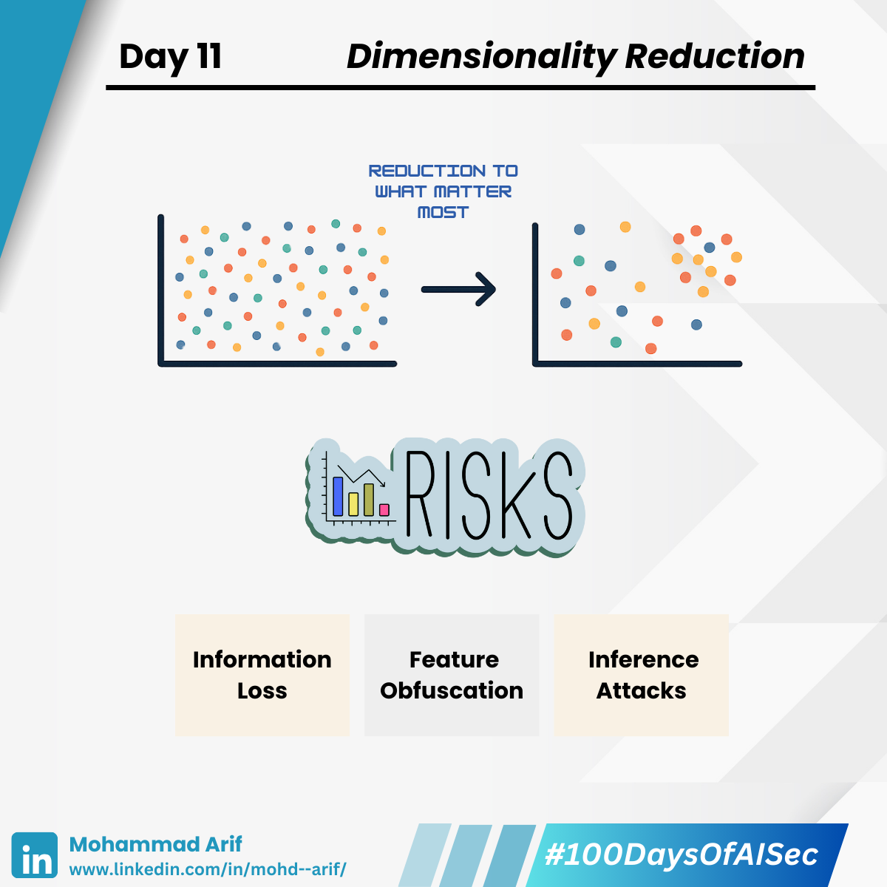

# Day 11 Dimensionality Reduction

***

**Today I explored Dimensionality Reduction** — a vital step to make sense of high-dimensional data 📉🔍

***

## 🔍 Analogy

> Imagine packing for a trip.\
> You have a massive wardrobe (your data), but your suitcase only fits 10 items.\
> So, you pick versatile clothes — a few that cover most needs (formal, casual, warm, cold).
>
> That’s Dimensionality Reduction:\
> **Compressing a huge dataset into its most meaningful parts — minimizing loss while maximizing utility.**

***

## 🔹 Two Common Techniques

### ✅ PCA (Principal Component Analysis)

🧳 Like folding and layering smartly to save space, PCA finds directions (components) that capture the most variance (info).

* Linear method
* Great when data lies in neat, straight patterns

### ✅ t-SNE (t-distributed Stochastic Neighbor Embedding)

🧳 Like grouping clothes by outfits (shoes + formalwear), t-SNE clusters related data together.

* Non-linear
* Captures local relationships, distorts global structure
* Ideal for visualizing complex, high-dimensional datasets

***

## 🚀 These techniques help models:

* ✅ Train faster
* ✅ Generalize better
* ✅ Reveal hidden patterns

***

## 🔐 Security Lens

### ⚠️ Information Loss & Blind Spots

🎒 You packed for summer, but forgot a raincoat.\
Rare threats (low variance) may get discarded — making your model blind to anomalies or attacks.

> "Low variance" ≠ "low importance" — especially in security contexts.

### ⚠️ Feature Obfuscation by Attackers

🎒 Attackers can embed malicious patterns in dimensions likely to be discarded or compressed — bypassing detection pipelines.

### ⚠️ Inference Attacks on Embeddings

🎒 It's like sharing a blurred photo of your bag — someone could still guess your travel habits from the outline of items.

t-SNE visualizations can leak structural info — attackers might infer relationships between users, labels, or features.\
These compressed representations, if exposed, can be mined or reversed to extract sensitive patterns or identities.

***

## 📚 Key References

* Jolliffe (2002) – _Principal Component Analysis_
* Carlini et al. (2020) – _Extracting Training Data from Embeddings_
* [StatQuest: t-SNE, Clearly Explained](https://lnkd.in/gxUtRGk7)

***

## 💬 Prompt

> Have you visualized your model with t-SNE?\
> What insights — or vulnerabilities — did you discover?

***

## 📅 Tomorrow

We explore **KNN & Clustering** — the simplest ML algorithms and how attackers exploit proximity logic 🔗👥

***

## 🔗 Missed Day 10?

Catch up here: [https://lnkd.in/gMh3rr8b](https://lnkd.in/gMh3rr8b)

***

**#100DaysOfAISec - Day 11 Post**\
\#AISecurity #MLSecurity #MachineLearningSecurity #DimensionalityReduction #CyberSecurity #AIPrivacy #AdversarialML #LearningInPublic #100DaysChallenge #ArifLearnsAI #LinkedInTech
