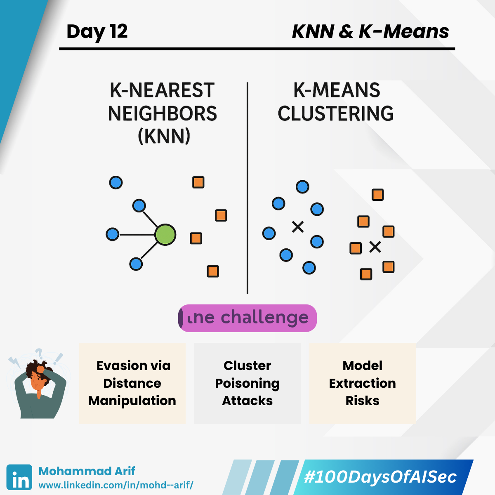

# Day 12
---
description: 
--- 

Today I explored two of the simplest — yet surprisingly powerful — machine learning techniques:

🔹 **K-Nearest Neighbors (KNN)**  
🔹 **Clustering Algorithms** like K-Means

---

## 🔸 KNN – Like asking your 3 closest neighbors for restaurant recommendations — and going with the majority.

- Doesn’t scale well with large data (**lazy learning**)  
- Suffers from the **curse of dimensionality**  
- **Use Case**: Real-time classification, stock market forecasting, data pre-processing

---

## 🔸 Clustering – Like sorting socks by color — no names, just similarity.

- Sensitive to initial conditions and number of clusters  
- Inability to handle categorical data  
- **Use Case**: Grouping similar logs across distributed DBs, customer segmentation, threat pattern discovery

---

## 🧠 Security Relevance

Both are intuitive, interpretable, and widely used in cybersecurity — for **anomaly detection**, **threat grouping**, and **log clustering**.  
But when **nearness = trust**, it opens the door to subtle — and dangerous — manipulations 👇

---

## 🔐 Security Lens

### ⚠️ Evasion via Distance Manipulation (KNN)

Attackers can subtly modify malicious inputs to appear close to benign ones — bypassing detection.

> 💡 Example: Slightly altered malware that lives in the "neighborhood" of clean files.

---

### ⚠️ Cluster Poisoning Attacks

In unsupervised setups, adversaries inject crafted data to **shift cluster centers** or **distort groupings**.

> 💡 Example: Fake logs or reviews injected to confuse anomaly detectors.

---

### ⚠️ Model Extraction Risks

KNN-based systems are **query-heavy** and **memory-based** — attackers can reconstruct training data if they know the distance metric.

> 💡 Example: API misuse to reverse-engineer sensitive training sets.

---

## 📚 Key References

- Jagielski et al. (2018): *Manipulating Machine Learning with Adversarial Clustering*  
- Tramer et al. (2016): *Model Extraction via Query Attacks*

---

## 💬 Discussion Prompt

> Have you ever used clustering for log analysis or threat detection?  
> What was your biggest challenge?

---

## 📅 Coming Up

**Naive Bayes** — and how its “strong independence” assumption becomes an adversary’s playground 🎯

---

## 🔗 Missed Day 11?

Catch up here: [https://lnkd.in/g3EwkEQA](https://lnkd.in/g3EwkEQA)

---

**#100DaysOfAISec - Day 12 Post**  
#AISecurity #MLSecurity #MachineLearningSecurity #KNN #Clustering #CyberSecurity #AIPrivacy #AdversarialML #LearningInPublic #100DaysChallenge #ArifLearnsAI #LinkedInTech