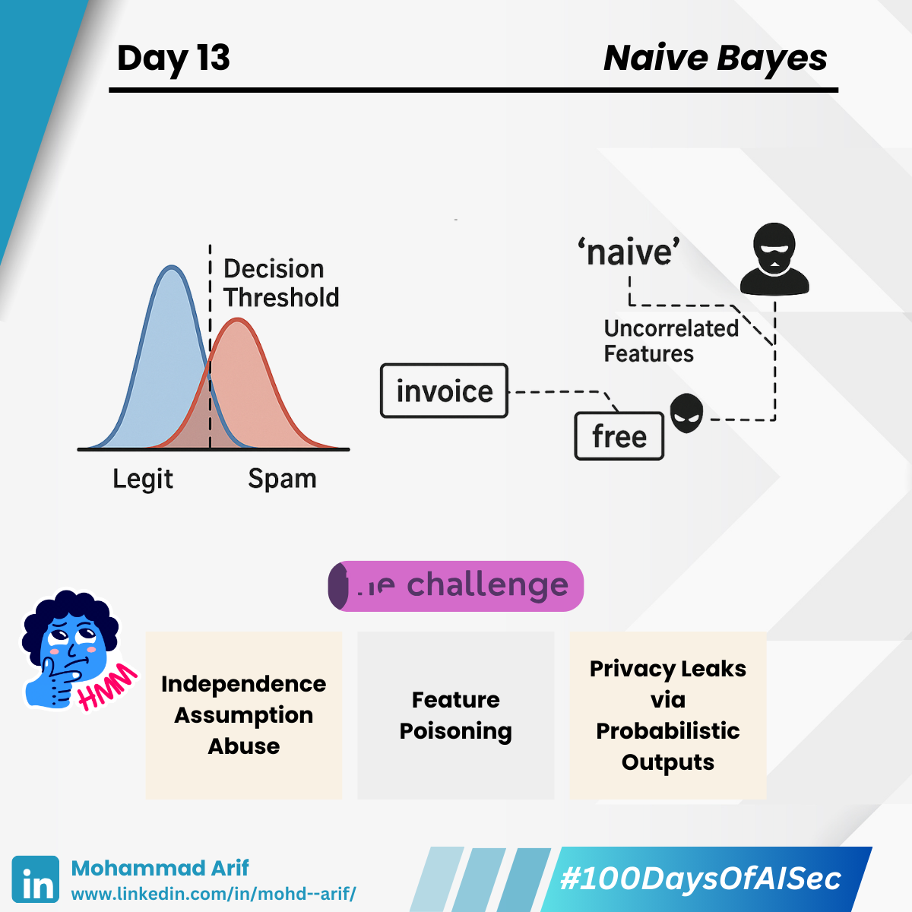

# Day 13 Naive Bayes

***

Today, I dove into one of the oldest and surprisingly effective ML classifiers — **Naive Bayes**.

🔹 It’s based on Bayes’ Theorem:\
`P(Class | Features) = [ P(Features | Class) × P(Class) ] / P(Features)`

🔹 The “naive” part? It assumes all features are independent — rarely true in reality, but often good enough, especially for text classification.

> Naive Bayes is like a doctor diagnosing a patient by looking at symptoms one at a time, assuming each symptom (like cough, fever, fatigue) occurs independently.\
> In reality, symptoms often correlate — but this simplified model still gets the diagnosis right surprisingly often.

***

### 🛠️ Common Use Cases

* ✅ Spam Filtering
* ✅ Text Classification
* ✅ Intrusion Detection Systems (IDS)

🧠 Despite its simplicity, Naive Bayes performs surprisingly well — particularly on high-dimensional datasets like emails and documents.

***

### 🚧 Limitations

* Struggles with non-linear relationships or complex interactions between features.
* Can be sensitive to skewed class distributions if not properly calibrated.

But that independence assumption? A sweet spot for attackers.

***

### 🔐 Security Lens

#### ⚠️ Independence Assumption Abuse

Attackers inject correlated features to game the classifier.\
&#xNAN;_&#x45;xample:_ A spam email might include benign terms like “invoice” or “team update” to lower its spam score and evade detection.

#### ⚠️ Feature Poisoning

Adversaries inject mislabeled or crafted data into the training set to skew feature probabilities, corrupting the model's logic.

#### ⚠️ Privacy Leaks via Probabilistic Outputs

Naive Bayes outputs probabilities. Confidence scores can leak info about the training data, enabling **membership inference attacks**.

***

### 📚 Key References

* Rubinstein et al. (2009) — _Privacy-Preserving Classification_
* Lowd & Meek (2005) — _Adversarial Learning in Naive Bayes Spam Filters_
* Biggio et al. (2013) — _Evasion Attacks against Machine Learning at Test Time_

***

### 💬 Question

**How much do you trust simple models like Naive Bayes in high-stakes systems?**\
Let’s discuss — sometimes old tools still hold up, but only when you know their limits.

***

📅 **Up next (Day 14):** Support Vector Machines (SVM) — and how attackers can shift the decision boundary to their advantage ⚖️

🔗 Missed Day 12? Catch up here: [https://lnkd.in/ghkbH6Nb](https://lnkd.in/ghkbH6Nb)

***

\#100DaysOfAISec #AISecurity #MLSecurity #MachineLearningSecurity #NaiveBayes #CyberSecurity #AIPrivacy #AdversarialML #LearningInPublic #100DaysChallenge #ArifLearnsAI #LinkedInTech
