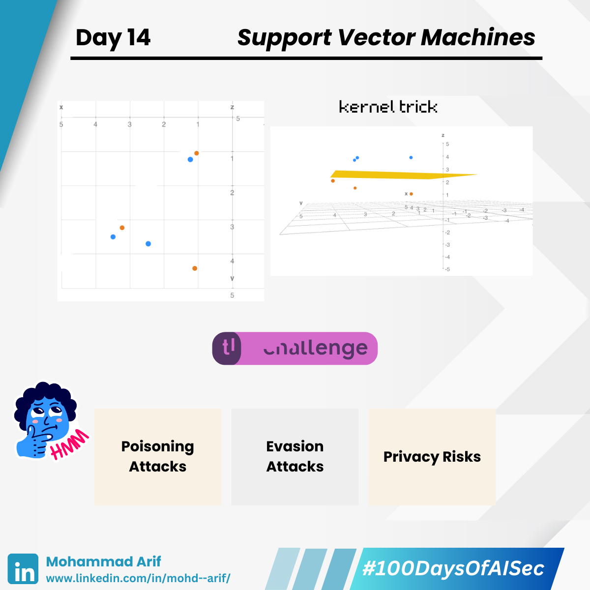

# Day 14 Support Vector Machines

***

Today I explored **Support Vector Machines (SVMs)** — powerful classifiers that find the best line to divide two groups, often resulting in strong classification performance.

🔸 They:

* ▪️ Maximize the margin
* ▪️ Perform well in high dimensions

> SVMs are like smart separators that find the best line to divide groups.\
> When groups are mixed up so no straight line works, “kernel tricks” transform the data into a higher-dimensional space where a plane can separate them — and then apply that separation back to the original data.

***

### 🧠 Widely Used In:

* ✅ Malware & fraud detection
* ✅ Bioinformatics
* ✅ Facial recognition

***

### ⚙️ Limitations

* ▪️ Not scalable for very large data
* ▪️ Sensitive to kernel & parameter choice
* ▪️ Memory-heavy with many support vectors
* ▪️ No native probability estimates

But SVMs can break under adversarial pressure.

***

### 🔐 Security Lens

#### ⚠️ Poisoning Attacks

Attackers inject borderline data during training to shift the decision boundary.\
🧪 _Example:_ Submitting "almost safe" frauds repeatedly\
🪞 _Analogy:_ Sneaking slightly defective items past quality checks\
✅ _Fix:_ Use robust loss functions, sanitize training data

#### ⚠️ Evasion Attacks

Small input tweaks help malicious samples cross the margin undetected.\
💡 _Example:_ Slightly altering a spam email to bypass filters\
🪞 _Analogy:_ Wearing a subtle disguise to fool face recognition\
✅ _Fix:_ Use adversarial training, model ensembles

#### ⚠️ Privacy Risks

Support vectors can leak real training data.\
🪞 _Analogy:_ Leaking key diary pages that reveal secrets\
✅ _Fix:_ Add noise or train with differential privacy

***

### 📚 References

* Biggio et al. (2012)
* Xiao et al. (2015)
* Papernot et al. (2016)
* Steinhardt et al. (2017)

***

### 💬 Question

**Have you used SVMs in production? How do you detect data drift?**

***

📅 **Tomorrow:** Activation Functions — how ReLU/Sigmoid might open attack surfaces ⚡

🔗 Missed Day 13? [https://lnkd.in/gpisFGjQ](https://lnkd.in/gpisFGjQ)

***

\#100DaysOfAISec #AISecurity #MLSecurity #MachineLearningSecurity #SupportVectorMachines #SVMs #CyberSecurity #AIPrivacy #AdversarialML #LearningInPublic #100DaysChallenge #ArifLearnsAI #LinkedInTech
