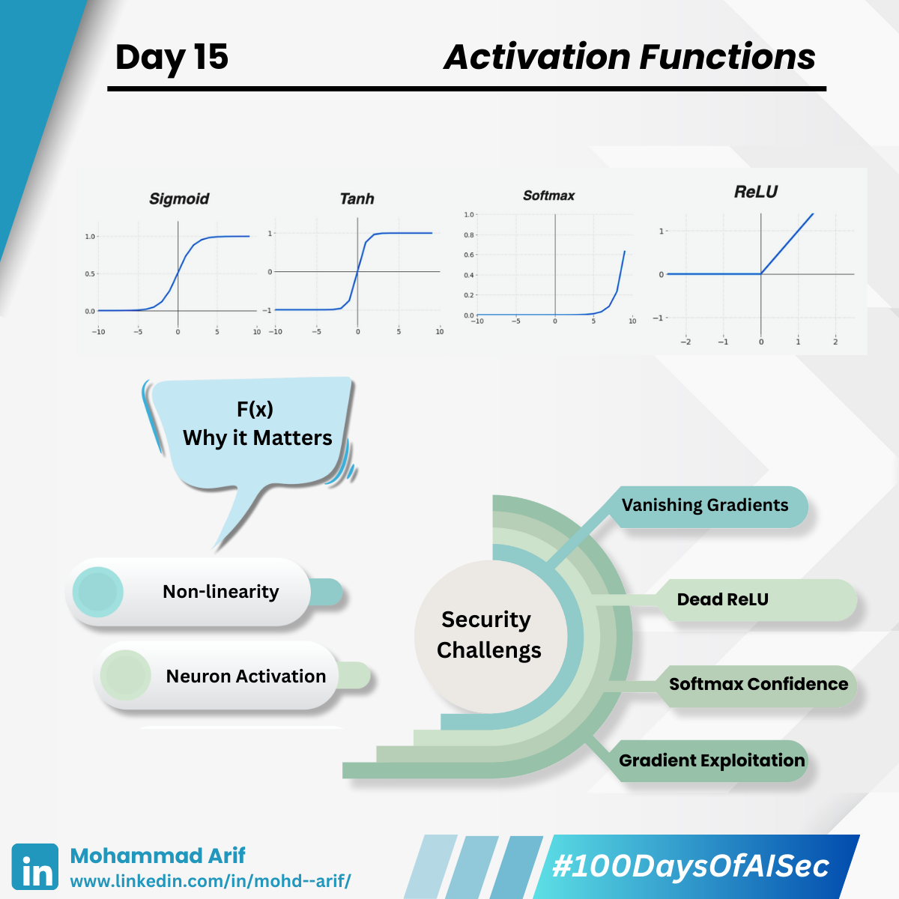

# Day 15 Activation Functions

***

## Activation Functions: Tiny Math Gates That Can Break Your Model

Think activation functions (ReLU, Sigmoid, Tanh, Softmax) are just boring math between layers? Think again!\
They shape how your model learns **and** how it can be attacked.

***

### 🔍 Why They Matter:

* Introduce non-linearity, enabling models to learn complex patterns
* Decide if a neuron "fires"
* Without them, deep learning is just glorified linear regression!

***

### 📌 Common Types

* **ReLU**: `max(0, x)` — Fast, promotes sparsity, but neurons can “die” (stay inactive)
* **Sigmoid**: S-shaped, squashes outputs to (0,1) — great for binary tasks, but prone to vanishing gradients
* **Tanh**: Like Sigmoid, but outputs (-1,1) — centers data for better gradients
* **Softmax**: Turns raw scores into probabilities — ideal for classification

***

### 🔐 Security Lens:

#### 📉 Vanishing Gradients (Sigmoid, Tanh)

* **Problem**: Gradients shrink in deep networks, stalling learning
* 💥 _Attack_: Poisoned data causes “gradient obfuscation,” weakening deep layers
* 🛡️ _Mitigation_: Use ReLU/variants, Layer Normalization

#### 💀 Dead ReLU Exploits

* **Problem**: ReLU outputs 0 for negative inputs — neurons can get stuck "off"
* 💥 _Attack_: Crafted inputs force critical neurons into this "dead" state
* 🛡️ _Mitigation_: Use Leaky ReLU or Parametric ReLU (PReLU)

#### 🤯 Softmax Confidence Overload

* **Problem**: Softmax assigns high confidence to even nonsensical inputs
* 💥 _Attack_: Fooling models (e.g., near-blank image → “Stop Sign” with 99% confidence) — huge risk in autonomous systems!
* 🛡️ _Mitigation_: Output regularization, Confidence Calibration (e.g., Temperature Scaling)

#### 👻 Gradient Exploitation (Smooth Activations like Sigmoid/Tanh)

* **Problem**: Smooth gradients are easier for attackers to reverse engineer
* 💥 _Attack_: Subtle adversarial examples that fool the model with high confidence
* 🛡️ _Mitigation_: Add gradient noise, use adversarial training

***

### 📚 Key References

* Goodfellow et al. (2014): Introduced adversarial examples
* Carlini & Wagner (2017): Robustness testing techniques
* Su et al. (2019): One-pixel attacks on deep neural networks

***

### 💬 Let’s Discuss!

* ML engineers: How do you prevent dead ReLUs in production?
* Security pros: Seen activation-related attacks in the wild?
* Everyone: How do you balance model performance vs. robustness?

***

📅 **Tomorrow**: Deep vs. Shallow Models — Which fails more gracefully under attack?

🔗 Missed Day 14? [https://lnkd.in/gvqKwDEK](https://lnkd.in/gvqKwDEK)

***

\#100DaysOfAISec #AISecurity #MLSecurity #MachineLearningSecurity #ActivationFunctions #CyberSecurity #AIPrivacy #AdversarialML #LearningInPublic #100DaysChallenge #ArifLearnsAI #LinkedInTech
