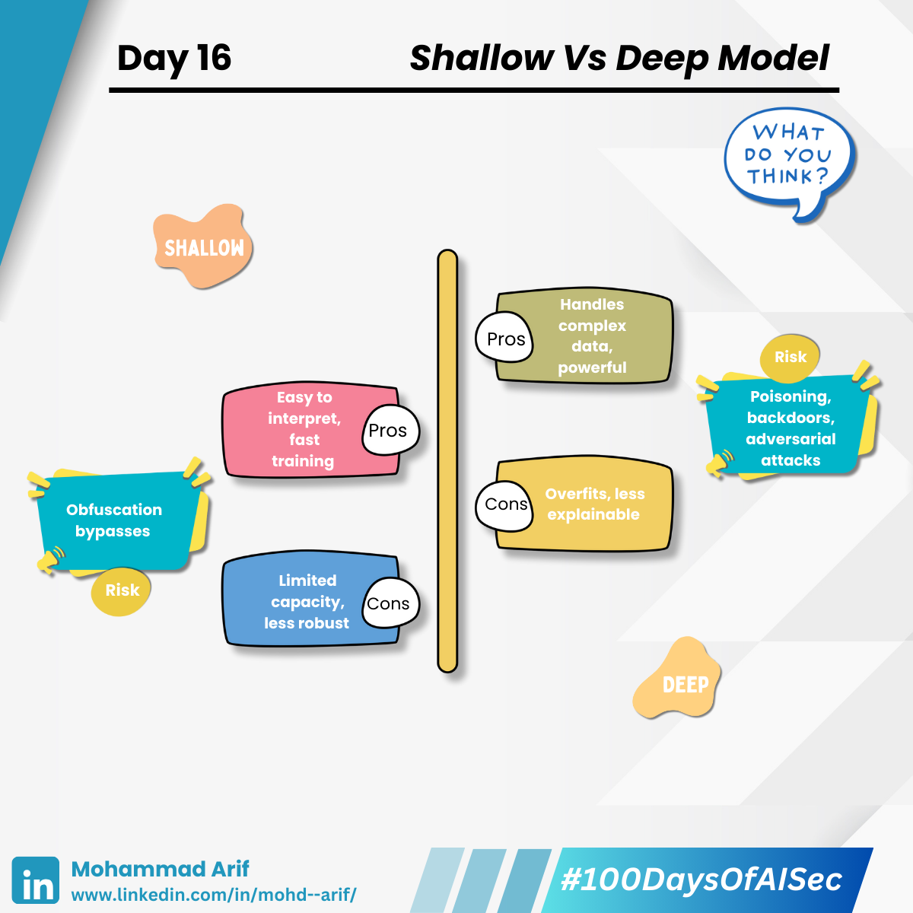

# Day 16 Deep vs Shallow Models

***

## 🔍 Shallow vs. Deep Models — What’s the Difference?

### 🧠 **Shallow Models (1–2 layers)**

Think logistic regression, decision trees, or simple SVMs.\
✅ Easy to interpret\
✅ Less prone to overfitting (especially with small datasets)\
❌ Limited ability to capture complex patterns

***

### 🧠 **Deep Models (3+ hidden layers)**

These are your typical neural networks used in vision, NLP, and more.\
✅ Excellent at learning abstract and nonlinear features\
✅ Essential for modern AI tasks\
❌ More prone to overfitting, adversarial attacks, and memorization risks

***

## 🔐 Security Lens — Where Things Break

### 1️⃣ Overfitting to Poisoned Data (Deep Models)

Deep models can **memorize** malicious training examples.\
💥 _Example_: Poison a single face in a dataset → model always misidentifies that person.

### 2️⃣ Gradient-Based Attacks

Deep models expose **smooth gradients**, perfect for crafting adversarial inputs.\
💥 _Example_: Slight pixel tweaks make a CNN label a “cat” as “guacamole.”

### 3️⃣ Explainability Gaps

Deep models = **black boxes**. Hard to reason about decisions → hard to audit for security.\
💥 _Risk_: Hidden backdoors via neuron triggers or malicious weight updates.

### 4️⃣ Robustness Trade-Offs (Shallow Models)

Shallow models are more interpretable, but **fragile** in high-dimensional spaces.\
💥 _Example_: A basic spam detector using logistic regression can be tricked with obfuscation (like “fr33 mon3y!”)

***

## 🧩 What Can Help?

* Defensive distillation
* Adversarial training
* Model explainability tools (e.g., **SHAP**, **LIME**)
* Regular audits of training data sources

***

### 📚 References

* **Ilyas et al. (2019)** — “Adversarial Examples Are Not Bugs, They Are Features”
* **Madry et al. (2018)** — “Towards Deep Learning Models Resistant to Adversarial Attacks”

***

### 💬 Question for You

Have you ever chosen a shallow model over a deep one to make it easier to audit or secure?

***

📅 **Tomorrow**: Hyperparameter Tuning — How optimizing accuracy can accidentally expose your model to attacks.

🔗 Missed Day 15? [https://lnkd.in/dMrvK\_yt](https://lnkd.in/dMrvK_yt)

***

\#100DaysOfAISec #AISecurity #MLSecurity #MachineLearningSecurity #DeepModels #ShallowModels #CyberSecurity #AIPrivacy #AdversarialML #LearningInPublic #100DaysChallenge #ArifLearnsAI #LinkedInTech
