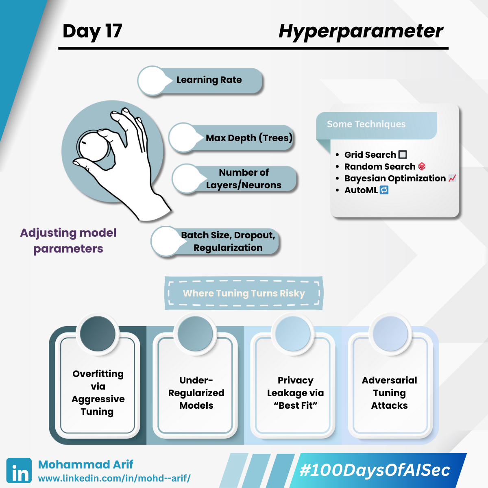

# Day 17
---
description: 
--- 

Today I explored one of the most crucial steps in ML development: **Hyperparameter Tuning** — where we squeeze out performance from a model by tweaking knobs like learning rate, depth, dropout, etc.

But tuning isn’t just about better accuracy — done carelessly, it opens unseen vulnerabilities.

---

### 🔧 What is Hyperparameter Tuning?

Parameters set before training (not learned):

- Learning rate  
- Max depth (trees)  
- Number of layers/neurons  
- Batch size, dropout, regularization, etc.

**Techniques:**

- Grid search 🔲  
- Random search 🎲 
- Bayesian optimization 📈  
- AutoML 🔁

---

### 🔐 Security Lens — Where Tuning Turns Risky

#### **Overfitting via Aggressive Tuning**

Highly tuned models can memorize noise or poisoned data.

💥 *Example*: In financial fraud detection, hyperparameter tuning over poisoned data results in consistent fraud cases being ignored.  
🛡️ *Mitigation*: Validate on clean, held-out test sets; monitor for data poisoning.

---

#### **Under-Regularized Models**

Improper dropout/L2 values → models generalize poorly and are vulnerable to adversarial inputs.

💥 *Example*: A CNN for document classification gets tuned for perfect accuracy but becomes sensitive to minor word order changes crafted by an attacker.  
🛡️ *Mitigation*: Apply minimum regularization; test against adversarial examples.

---

#### **Privacy Leakage via “Best Fit”**

Tuning may amplify memorization, causing models to regurgitate sensitive data points.

💥 *Example*: A tuned model on medical data leaks a real patient’s diagnosis when queried.  
🛡️ *Mitigation*: Use differential privacy techniques; audit for data leakage.

---

#### **Adversarial Tuning Attacks (emerging)**

In shared ML pipelines (e.g., cloud training), attackers can manipulate tuning inputs to sabotage the final model.  
🛡️ *Mitigation*: Validate tuning inputs; monitor for anomalies in shared environments.

---

### 📚 Key References

- *Carlini et al. (2021)*: _Extracting Training Data from Language Models_  
- *Kandemir et al. (2022)*: _Hyperparameter Stealing Attacks on ML APIs_  
- [Hands-On Hyperparameter Tuning with Scikit-Learn: Tips and Tricks](https://lnkd.in/g-PDVPuU)

---

### 💬 Question for You:

**Do you automate hyperparameter tuning, and if so, how do you monitor for security regressions during the process?**

---

📅 **Tomorrow**: We explore *Bias & Variance* ⚖️

🔗 **Missed Day 16?**  
[https://lnkd.in/gVMyWMSJ](https://lnkd.in/gVMyWMSJ)

---

**#100DaysOfAISec** #AISecurity #MLSecurity #MachineLearningSecurity #ModelTunning #Hyperparameter #CyberSecurity #AIPrivacy #AdversarialML #LearningInPublic #100DaysChallenge #ArifLearnsAI #LinkedInTech
