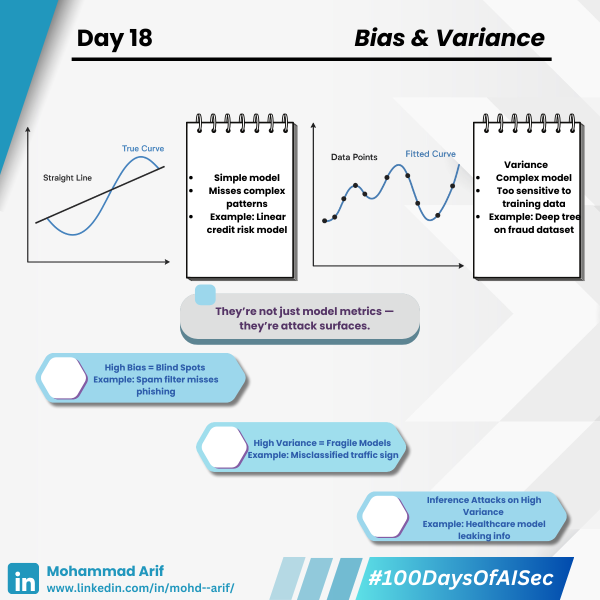

# Day 18 Bias & Variance

***

**Bias and variance aren’t just academic — they silently shape your model’s risk profile.**

Bias and variance aren't just ML buzzwords — they're the core forces that shape every model's behaviour. If misunderstood, they can lead to serious security vulnerabilities in deployed AI systems.

Let’s break it down from both an ML and security lens 🧠🔐

***

## ⚖️ What’s Bias and Variance?

**Bias** = Assumptions made by the model to learn the target function

* **High bias** → Oversimplified model
* _Example:_ Linear model trying to predict credit risk using complex financial data

**Variance** = Model’s sensitivity to training data

* **High variance** → Overfitting to noise
* _Example:_ Deep tree perfectly classifies training fraud cases, but fails on new patterns

***

## 🔐 Security Lens — How Bias & Variance Impact Model Safety

### 🕳️ High Bias = Blind Spots

Underfitted models may entirely miss fraud patterns or abnormal behavior.\
💥 _Example:_ A simplistic spam filter ignores nuanced phishing emails, giving attackers a clear bypass.

### 🧪 High Variance = Fragile Models

Overfitted models are easier to fool with adversarial inputs.\
💥 _Example:_ An image classifier trained on a small dataset misclassifies slightly altered traffic signs — dangerous for autonomous vehicles.

### 🕵️‍♂️ Inference Attacks on High Variance Models

Models that memorize training data are prime targets for membership inference or model extraction.\
💥 _Example:_ A healthcare model with high variance leaks patient attributes when queried repeatedly.

> Sophisticated attackers probe for models that are too simple or too specific — the "bias-variance sweet spot" becomes a reconnaissance opportunity.

***

## 📚 Key References

* Li et al. (2021): _Membership Inference Attacks Against Overfitted Models_
* Baracaldo et al. (2017): _Privacy-preserving ML with Model Regularization_
* Aditya Bharathi: [Linear Regression Fails, Ridge Regression the Way](https://sapiencespace.com/linear-regression-fails-ridge-regression-the-way/)

***

## 💬 Question for You

Have you ever tuned a model for better accuracy, only to discover it introduced new attack surfaces?

***

📅 **Tomorrow:** We explore _Cross-Validation_ — the secret weapon to detect overfitting before it’s too late ✅

🔗 **Missed Day 17?**\
[https://lnkd.in/g5W5KR8X](https://lnkd.in/g5W5KR8X)

***

#### #100DaysOfAISec - Day 18 Post

\#AISecurity #MLSecurity #MachineLearningSecurity #BiasVariance #ModelSecurity\
\#CyberSecurity #AIPrivacy #AdversarialML #LearningInPublic #100DaysChallenge #ArifLearnsAI #LinkedInTech
