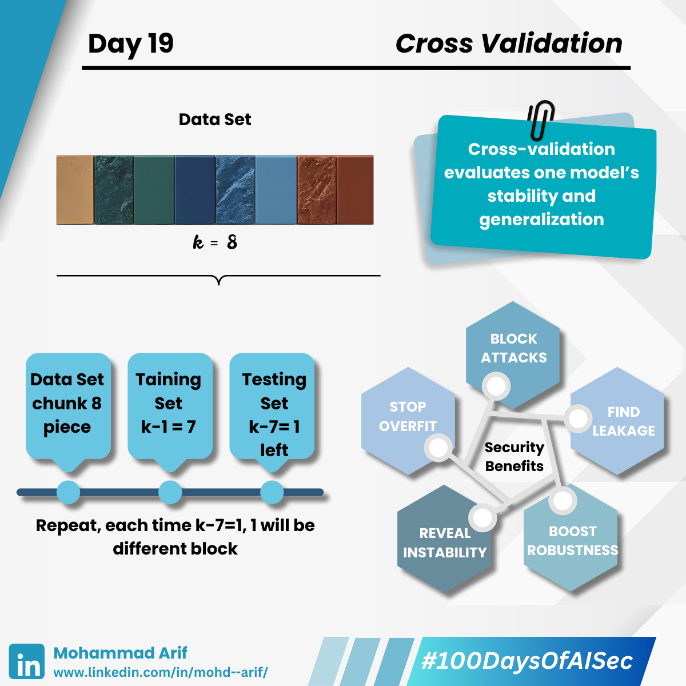

# Day 19
---
description: 
--- 

Today I explored **Cross-Validation** — a powerful evaluation technique that doesn’t just boost performance... it also helps catch **overfitting** before it becomes a security liability 🔐

Let’s break it down 👇

## 📌 What is Cross-Validation?

Instead of training and testing on a single split, cross-validation divides the dataset into multiple chunks.

Each time, a different chunk is used as the test set, while the rest are used for training.  
This process is repeated multiple times, and the performance is averaged to assess model generalization.

---

### 🔁 k-Fold Cross-Validation is the most common:

- Split data into **k** parts  
- Train on **k–1** parts, test on the remaining part  
- Repeat **k** times and average the results

---

## 🔐 Security Lens — Why Cross-Validation Matters

### ✅ Prevents Overfitting

Overfit models memorize training data — making them vulnerable to:
- **Membership inference** (guessing if data was in training)
- **Model inversion** (reconstructing sensitive inputs)

✅ Cross-validation helps detect if your model is over-relying on training samples

---

### ⚠️ Detects Data Leakage

If performance is *too good* during cross-validation, check for leakage (e.g., target variables leaking into features)

💥 **Example**: A fraud detection model performing with 99% accuracy might be “cheating” due to a timestamp feature correlated with fraud labels

---

### 📉 Reveals Model Instability

Models with high variance across folds are unstable — and more likely to fail in real-world scenarios

💥 **Example**: A malware classifier that varies drastically across folds is easier to evade through simple obfuscation

---

### 🎯 Bonus Tip:
Use **Stratified k-Fold** when dealing with imbalanced classes (e.g., fraud vs legitimate) to maintain consistent label distribution.

---

## 📚 Key Reference:

- *Carlini et al. (2022)*: *Membership Inference Attacks from a Privacy Perspective*  
- *Scikit-learn Documentation*: Model Evaluation  
- [https://youtu.be/fSytzGwwBVw](https://youtu.be/fSytzGwwBVw)

---

## 💬 Question for You  
**How do you currently evaluate your AI models for robustness? Have you ever caught a security flaw through cross-validation?**

---

📅 **Tomorrow**: We dive into **Ensemble Learning** — and how combining models can boost both accuracy and security 🧠🔐

🔗 **Missed Day 18?**  
[https://lnkd.in/gbtjJRsi](https://lnkd.in/gbtjJRsi)

---

#100DaysOfAISec #AISecurity #MLSecurity #MachineLearningSecurity #CrossValidation  
#CyberSecurity #AIPrivacy #AdversarialML #LearningInPublic #100DaysChallenge  
#ArifLearnsAI #LinkedInTech
