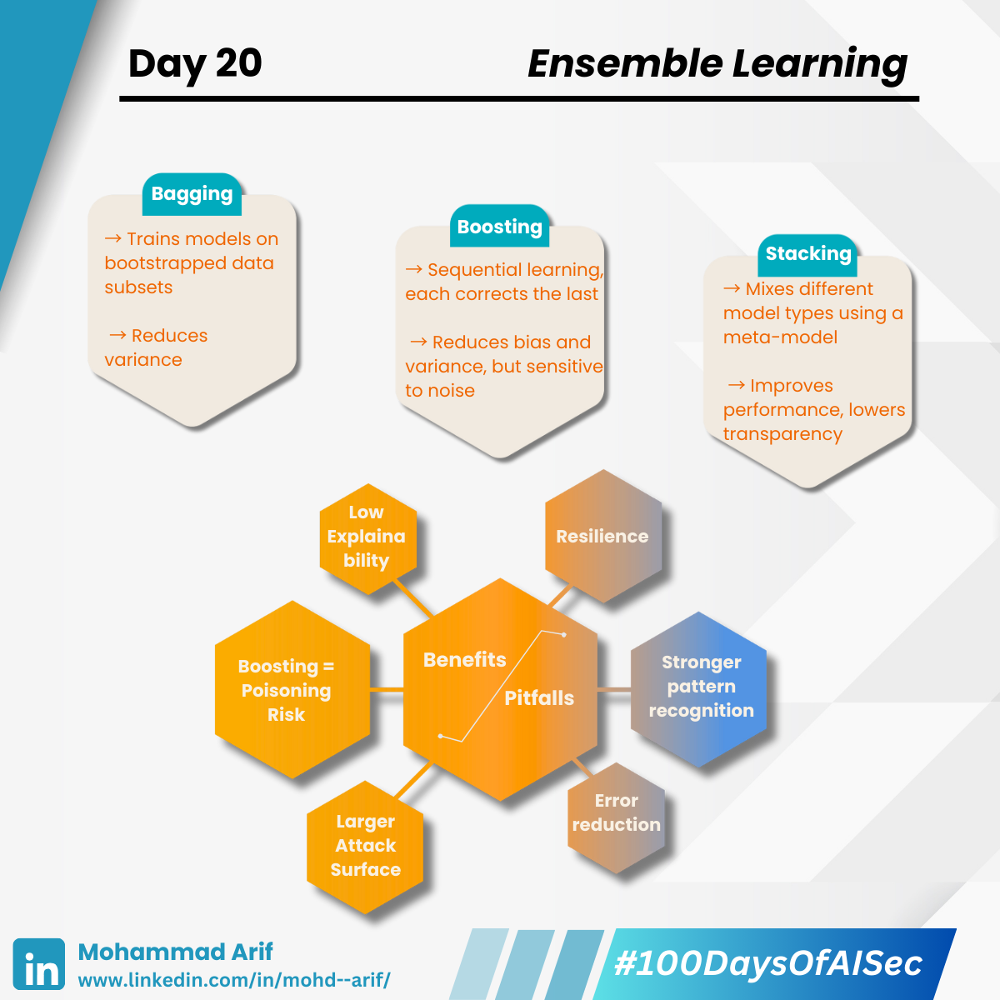

# Day 20 Ensemble Learning

Today, I explored **Ensemble Learning** — the strategy of combining multiple models to boost accuracy and resilience.

But in security, ensembles are a double-edged sword: they can mitigate certain risks, while introducing new ones.\
Let’s unpack it 👇

***

## 🤖 What is Ensemble Learning?

It’s the art of aggregating multiple “weak” or diverse models to create a stronger, more generalizable one.

### 🔹 Bagging (Bootstrap Aggregating) — _e.g., Random Forest_

* Reduces variance and increases robustness
* Trains models on randomly sampled subsets of data

### 🔹 Boosting — _e.g., XGBoost, AdaBoost_

* Trains models sequentially, each correcting the previous one’s errors
* Can reduce both bias and variance
* More sensitive to data anomalies and outliers

### 🔹 Stacking

* Combines different model types via a meta-model
* Often achieves higher performance at the cost of explainability

***

## 🔐 Security Lens — Ensemble Pros and Pitfalls

### ✅ Pros

* ✔ Increased resilience against random noise and individual model failure
* ✔ More robust in detecting complex patterns (e.g., in fraud or intrusion detection)

### ⚠ Pitfalls

#### 🔸 Larger Attack Surface

More models = more code, complexity, and potential for misconfiguration or bugs

#### 🔸 Boosting is Susceptible to Poisoning

Adversaries can inject malicious samples early in training\
➡️ These get over-learned and disproportionately affect the final model\
💥 _Example_: In fraud detection, a poisoned transaction labeled “legitimate” may bias the boosting model to overlook similar frauds

#### 🔸 Obscured Explainability

Complex ensembles make it harder for security teams to audit decisions\
➡️ Risky in regulated domains (e.g., finance, healthcare)

***

## 📚 References

* _Biggio et al. (2018)_: _Wild Patterns: Ten Years After the Rise of Adversarial ML_
* _XGBoost Security Notes_

***

## 💬 Question for You

**How do you balance model performance vs explainability in high-risk domains like fraud detection or content moderation?**

***

🔗 **Missed Day 19?**\
[https://lnkd.in/gckW7DvP](https://lnkd.in/gckW7DvP)

***

\#100DaysOfAISec #AISecurity #MLSecurity #MachineLearningSecurity #EnsembleLearning\
\#CyberSecurity #AIPrivacy #AdversarialML #LearningInPublic #100DaysChallenge\
\#ArifLearnsAI #LinkedInTech
