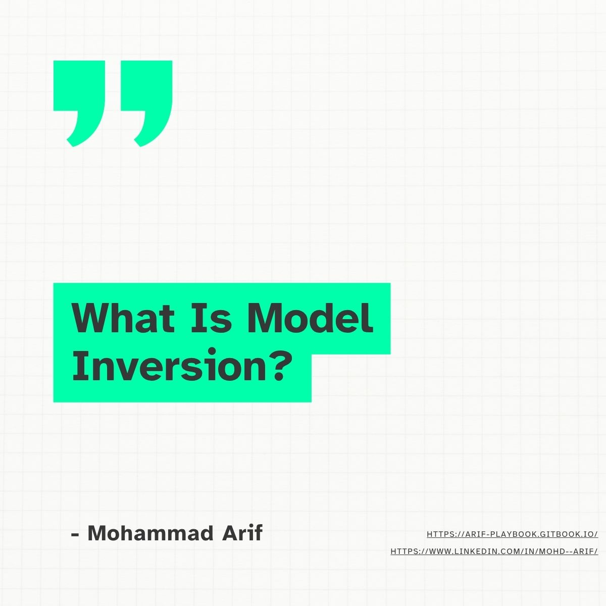
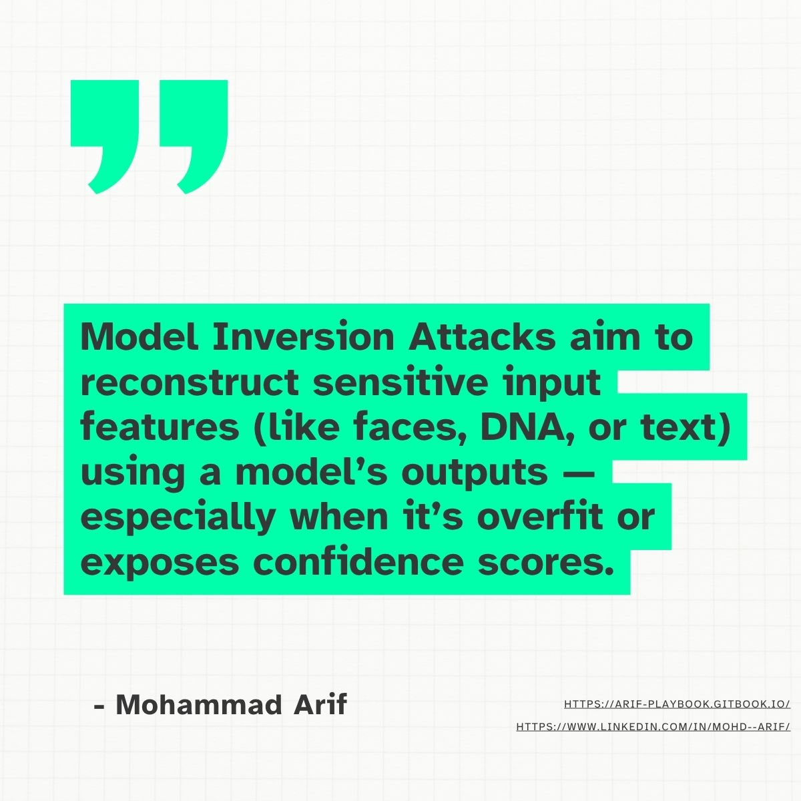
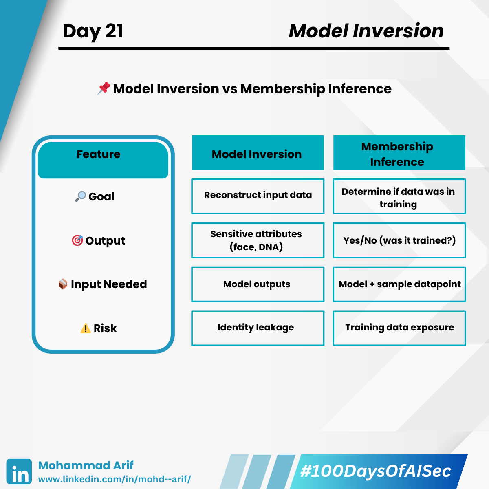
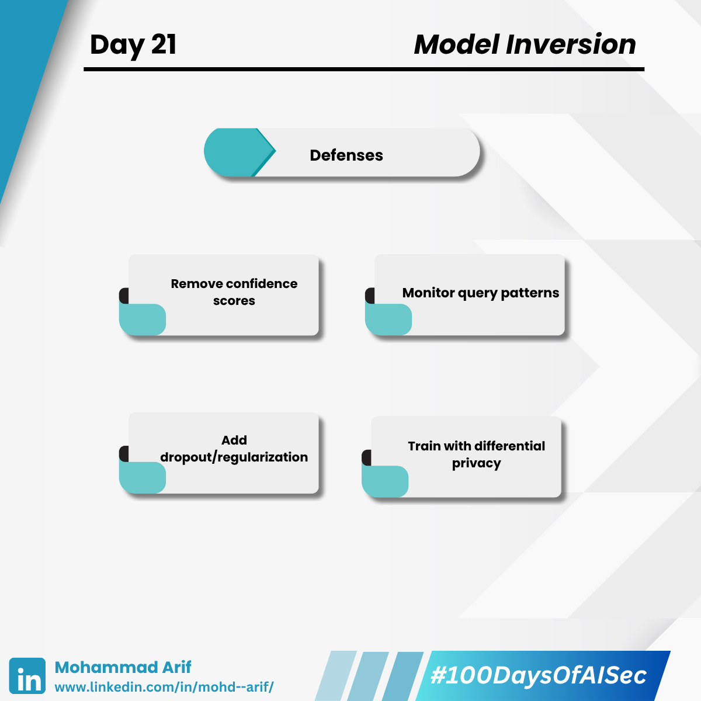

# Day 21 Model Inversion

## Model Inversion Attacks – Reconstructing Faces from ML Models 🤯

<figure><figcaption></figcaption></figure> <figure><figcaption></figcaption></figure> <figure><figcaption></figcaption></figure> <figure><figcaption></figcaption></figure> <figure><figcaption></figcaption></figure>

> Imagine asking an AI model about diabetes risk — and reconstructing a patient’s face.\
> That’s not sci-fi. That’s model inversion — and it’s happening now.

***

### 🔍 What Is Model Inversion?

Model Inversion Attacks aim to **reconstruct sensitive input features** (like faces, DNA, or text) using a model’s **outputs** — especially when it’s overfit or exposes **confidence scores**.

🧠 When trained on PII-rich data, models can unintentionally **leak individual details** from the training set.

***

### 🧪 Real-World Example

**📚 Fredrikson et al. (2015):**

* Trained a model to predict warfarin dosage.
* By probing the model with known inputs, they **reconstructed genetic markers** of real patients.

**🎭 Facial Recognition:**\
Similar attacks recreated **faces** from facial recognition models — just by analyzing output scores.

***

### 🧠 Different Models, Different Risks

* 🖼️ **Image Models**: Attackers can recreate training images.
* 📄 **Text Models (LLMs)**: May regenerate secrets, passwords, or emails.
* 📊 **Graph Models**: Can leak node attributes or private edges.

***

### 🔐 Defenses (Summary)

✅ Don’t expose **confidence scores** or **logits** publicly.\
✅ Train with **differential privacy**.\
✅ Use **dropout/regularization** to reduce memorization.\
✅ **Monitor** for unusual query patterns (e.g., mass probing).

***

### ❗ Model Inversion vs Membership Inference

| Attack Type              | Goal                           | Input             | Output               |
| ------------------------ | ------------------------------ | ----------------- | -------------------- |
| **Model Inversion**      | Rebuild sensitive data         | Model outputs     | Reconstructed inputs |
| **Membership Inference** | Detect if data was in training | Model + datapoint | Yes / No             |

***

### 💬 Thought Starter

> Would you expose **top-5 predictions with confidence scores** in production?\
> How do you balance **model utility** vs **user privacy**?

***

### 🔗 Resources

* 📙 **Recap of Day 1–20**: [LinkedIn Post](https://www.linkedin.com/posts/mohd--arif_100daysofaisec-100daysofaisec-mlsecurity-activity-7327558186935156736-619f)
* 📘 **GitBook (All Posts)**: [100 Days of AI Sec](https://arif-playbook.gitbook.io/100-days-of-ai-sec)

***

### 🏷️ Tags

\#100DaysOfAISec #AISecurity #MLSecurity #ModelInversion #CyberSecurity #AIPrivacy #AdversarialML #LearningInPublic #MachineLearningSecurity #100DaysChallenge #ArifLearnsAI #LinkedInTech
