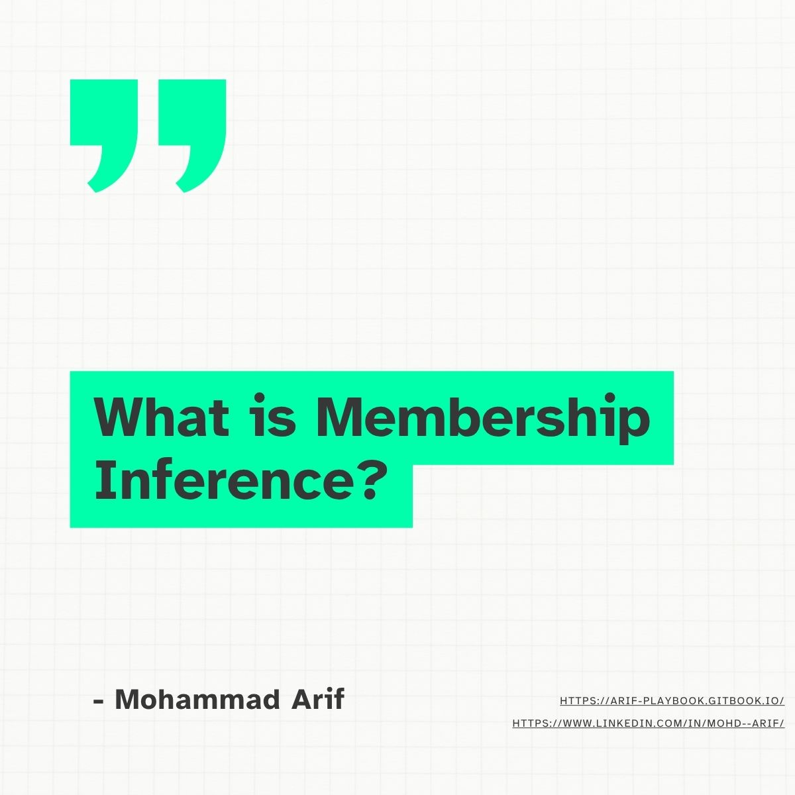
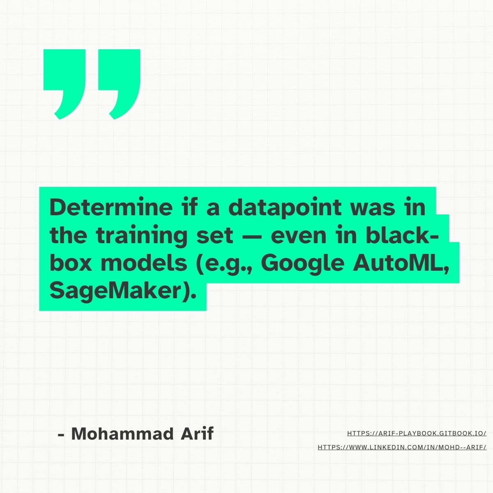
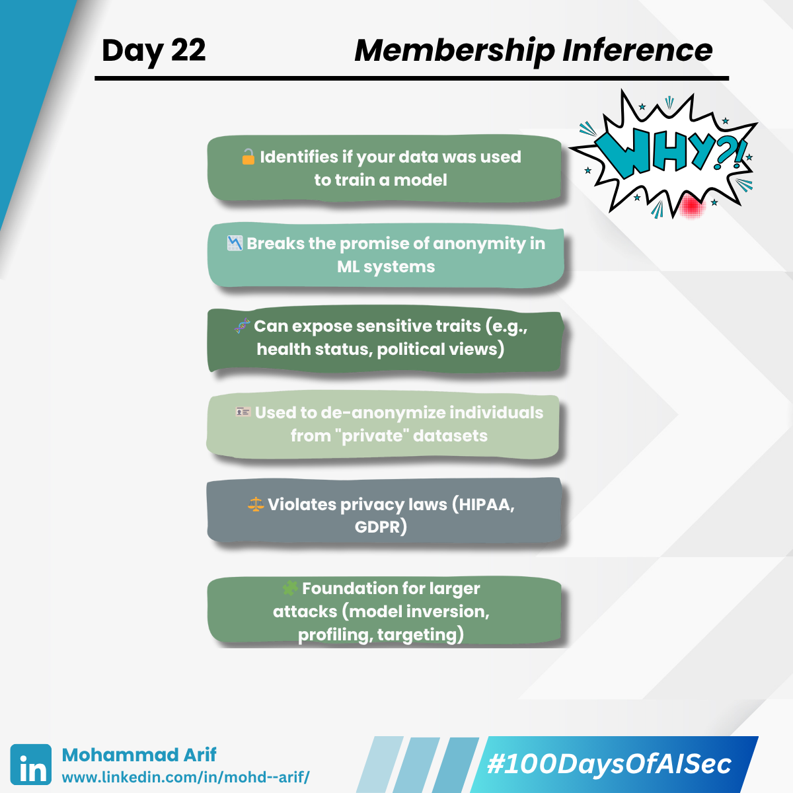
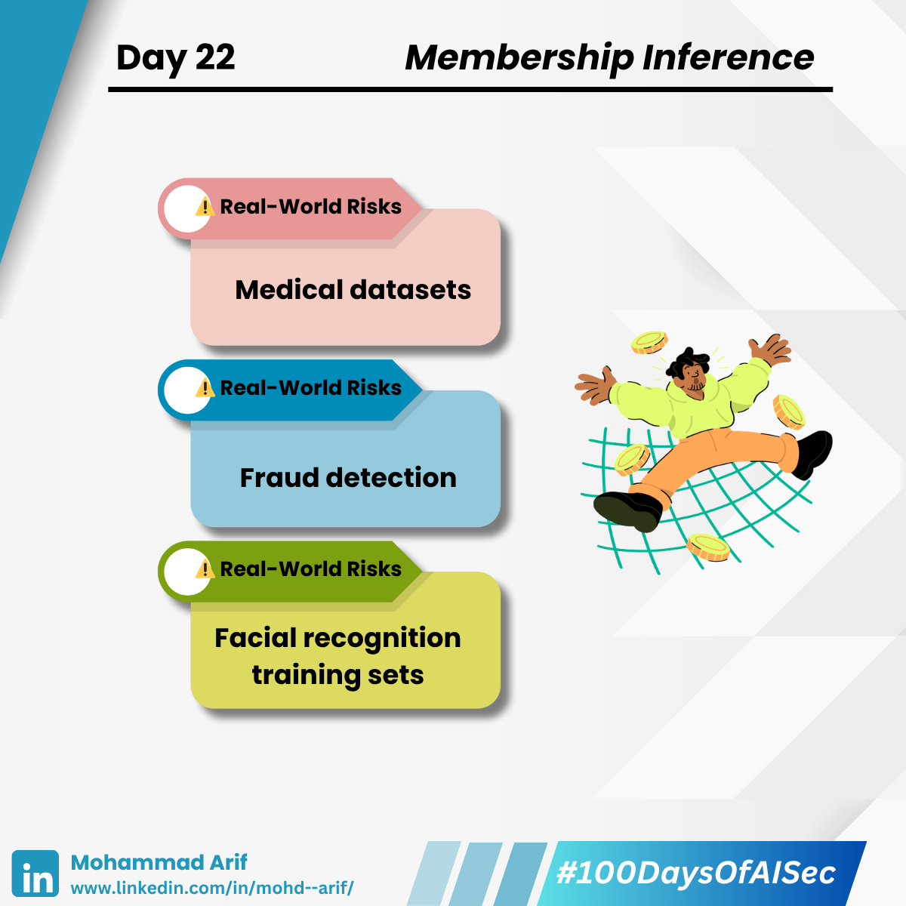
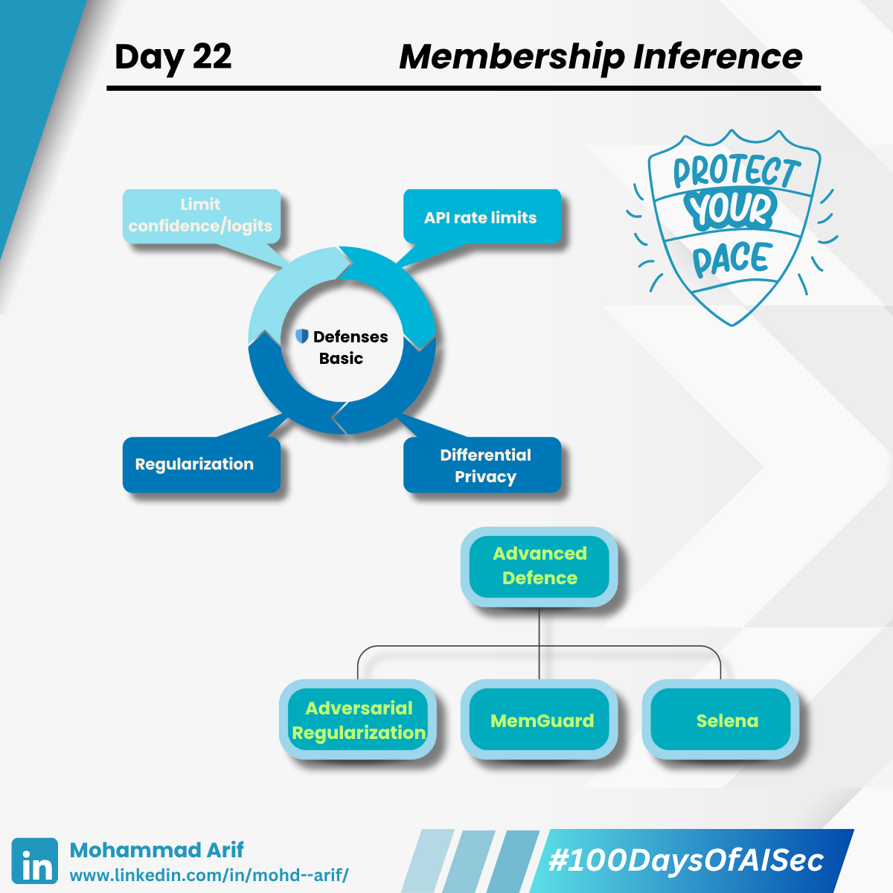

# 🔐 Day 22: Membership Inference Attacks — Does the Model Remember You?

<figure><figcaption></figcaption></figure> <figure><figcaption></figcaption></figure> <figure><figcaption></figcaption></figure> <figure><figcaption></figcaption></figure> <figure><figcaption></figcaption></figure>

Membership Inference Attacks (MIA) allow an adversary to determine whether a specific data point was used to train a machine learning model — **just by querying the model and observing its outputs**.

Even **black-box models**, like those offered via MLaaS (e.g., Google AutoML, Amazon SageMaker), are vulnerable.

---

## 🧠 Why This Happens

- **Curiosity**: Is someone trying to learn if their or others’ data was used?
- **Information Gathering**: For reconnaissance in larger attacks.
- **System Auditing**: Used to check for compliance or unintended data retention.

---

## ⚠️ Why It’s Dangerous

- **Privacy Leaks**: Attackers may extract sensitive training data like names, health records, or financial info.
- **Compliance Violations**: GDPR, HIPAA, and other laws forbid certain types of data usage without consent.
- **Trust Erosion**: Users may lose trust in models that unintentionally "remember" them.

---

## 🔍 How It Works

Models typically perform better (with higher confidence, lower loss) on training data compared to unseen inputs.  
Attackers exploit this difference using:

- **Confidence scores / Logits**
- **Shadow models**
- **Query-based probing**

---

## 🧪 Real-World Attacks

### 1. Shokri et al. (2017)

- Introduced MIA using shadow models to train and mimic target models.
- Demonstrated attacks against Google’s ML-as-a-Service platform.

### 2. Carlini et al. (2021)

- Extracted actual training data, including **PII**, from GPT-style large language models.
- Showed that even LLMs are vulnerable to data leakage.

---

## 🛡️ Defenses

### ✅ Basic Defenses

- **Differential Privacy** during training
- **Limit exposure** of confidence/logit values
- **Regularization** (e.g., dropout, weight decay)
- **API rate limiting** and **query throttling**

### 🔐 Advanced Defenses

- **MemGuard**: Uses adversarial perturbations to hide membership signals
- **Selena**: Ensembles of noisy models to reduce overfitting and information leakage
- **Adversarial Regularization**: Trains the model to be indistinguishable for member/non-member queries

---

## 🗣️ Questions to Reflect

- Would your ML model pass a **membership inference audit**?
- Are you tracking **confidence leakage** through public or internal APIs?

---

## 📚 References

- Shokri et al., 2017: *Membership Inference Attacks Against Machine Learning Models*  
- Carlini et al., 2021: *Extracting Training Data from Large Language Models*

---

