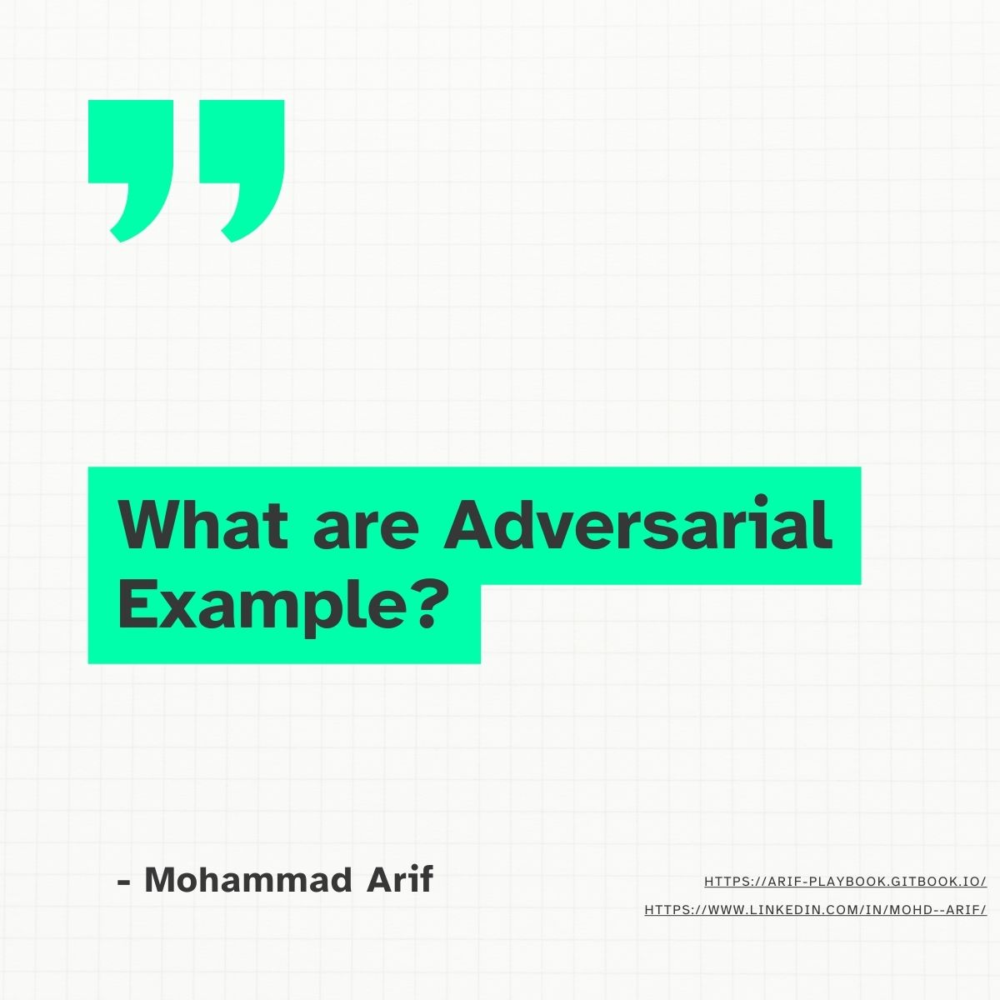
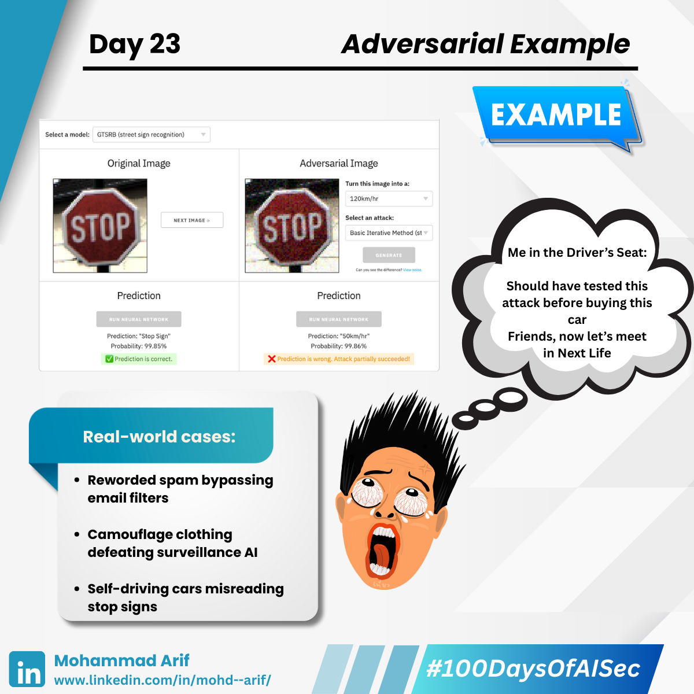
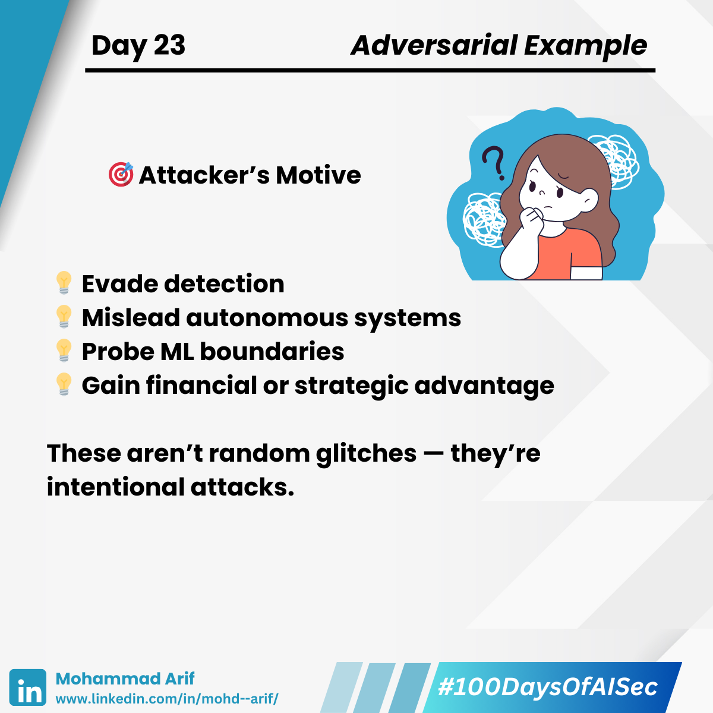
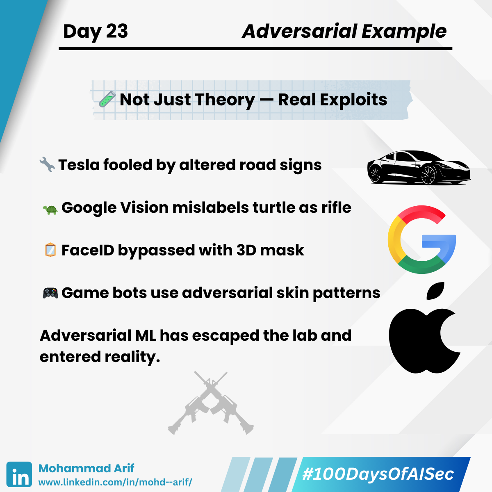
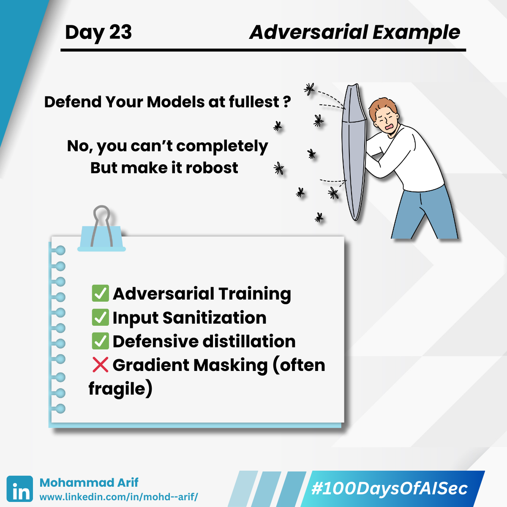

# Day 23 Adversarial Examples

## When ML Sees What’s Not There

Imagine adding a few pixels of noise to a stop sign…  
and suddenly a self-driving car thinks it’s a speed limit sign.  
That’s not science fiction — that’s Adversarial Machine Learning in action.

<figure><figcaption></figcaption></figure> <figure><figcaption></figcaption></figure> <figure><figcaption></figcaption></figure> <figure><figcaption></figcaption></figure> <figure><figcaption></figcaption></figure><figure><figcaption></figcaption></figure>

---

## 🎯 What Are Adversarial Examples?

Inputs that are intentionally and subtly modified to fool machine learning models — without changing what a human would perceive.

**Examples:**

- 🐼 + invisible noise ➡️ 🦍  
  *(ImageNet misclassification from Goodfellow et al., 2014)*
- 📝 Reworded spam that passes email filters
- 📸 Camouflaged clothing that bypasses surveillance AI

These attacks exploit linear weaknesses in high-dimensional models — essentially hacking the math behind ML.

---

## 🔍 Motive of the Attacker

Why craft adversarial examples?

- 🎯 **Evade detection**: Slip past spam filters, malware classifiers, or surveillance tools.
- 🎯 **Trigger misclassification**: Mislead self-driving cars or biometric systems into dangerous decisions.
- 🎯 **Model probing**: Map model boundaries or reverse-engineer behavior.
- 🎯 **Strategic or financial gain**: Disrupt AI-driven systems (ads, pricing, fraud detection) for profit or sabotage.

---

## 🔐 Security Lens

### ⚠️ Evasion Attacks

Craft inputs at inference time to bypass detection.  
→ *e.g., tweak malware binaries or phishing images*

### ⚠️ Black-box Attacks

Don’t need access to model internals — thanks to transferability, attacks created for one model often work on others.

### ⚠️ Physical-World Attacks

Stickers on road signs or custom glasses that fool facial recognition.  
Adversarial ML escapes the lab — and enters reality.

---

## 🧪 Real-World Examples

- 🔧 Tesla Autopilot fooled by altered road signs – [Tencent Keen Lab]
- 🐢 Google Vision API labeled turtle as rifle
- 🪞 Apple FaceID bypassed by 3D-printed mask (2017 demo)

These are not theoretical flaws — they’ve already been exploited.

---

## 🛡 Defenses (Imperfect, But Useful)

- ✅ **Adversarial Training** – Train with adversarial examples  
- ✅ **Input Sanitization** – Remove or normalize noise  
- ✅ **Certified Defenses** – e.g., randomized smoothing  
- ✅ **Gradient Masking** – Obfuscate gradients (*but fragile!*)  
- ✅ **Reject Suspicious Inputs** – Flag inputs close to decision boundaries  
- ✅ **Defensive Distillation**

---

## 📚 Key References

- Goodfellow et al. (2014) – *“Explaining and Harnessing Adversarial Examples”*
- Kurakin et al. (2016) – *“Adversarial Examples in the Physical World”*
- Athalye et al. (2018) – *“Obfuscated Gradients Give a False Sense of Security”*

🔗 [Adversarial.js by Kenny Song](https://kennysong.github.io/adversarial.js/)

---

## 💬 Question for You

**How do you test your models for adversarial robustness?**  
Should it be part of every AI model's CI/CD pipeline?

---

## 📅 Coming Up

**Day 23 → Data Poisoning Attacks** – when the training data becomes the attack vector. 🔥

---

## 🔗 Catch Up on Day 22

- [LinkedIn Post](https://www.linkedin.com/posts/mohd--arif_100daysofaisec-100daysofaisec-aisecurity-activity-7328488388116774915-AdyP)
