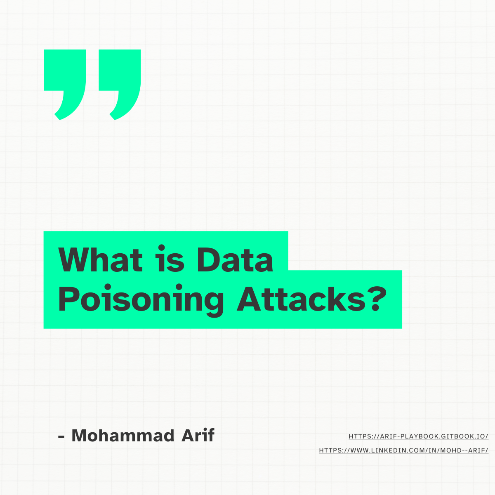
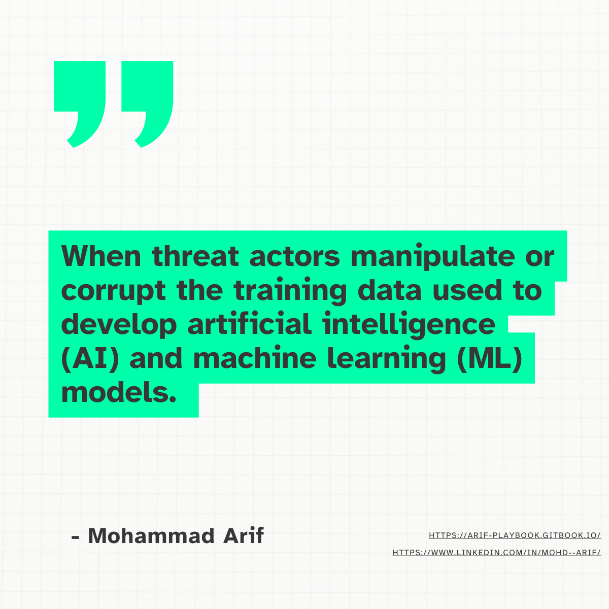
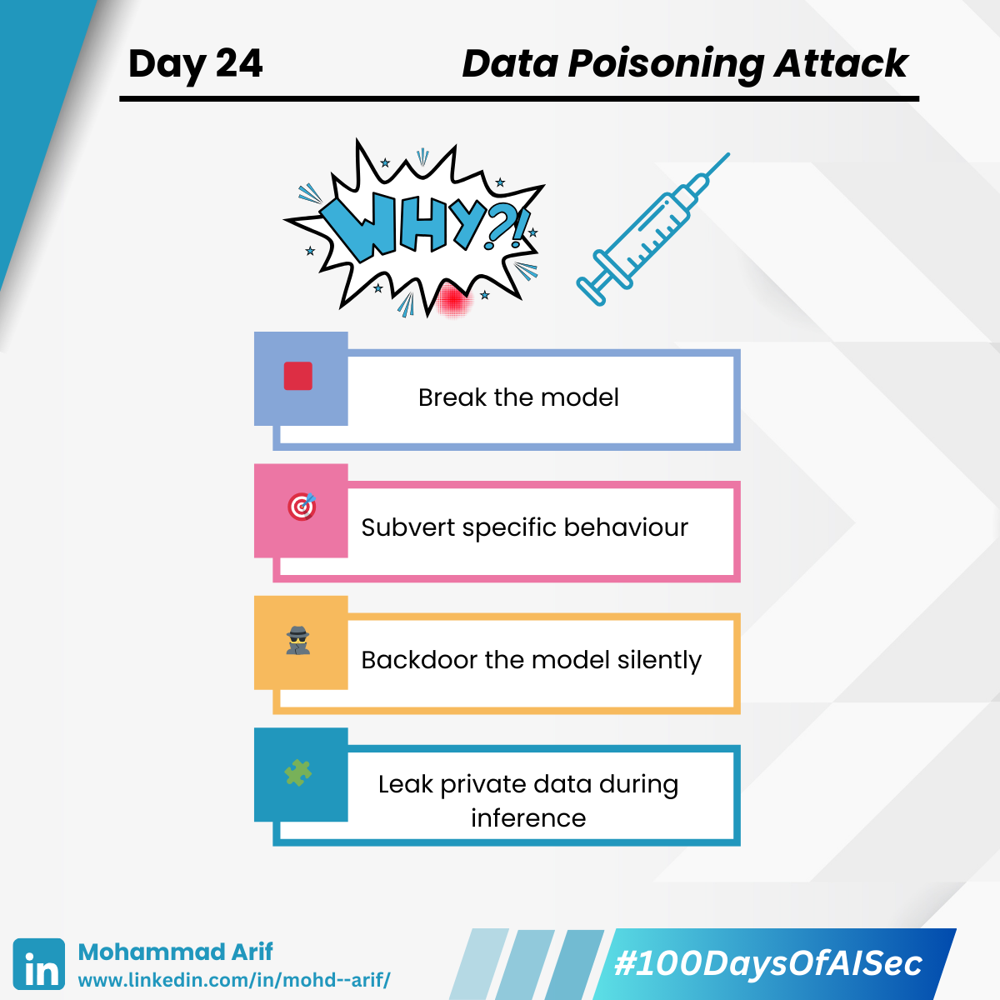
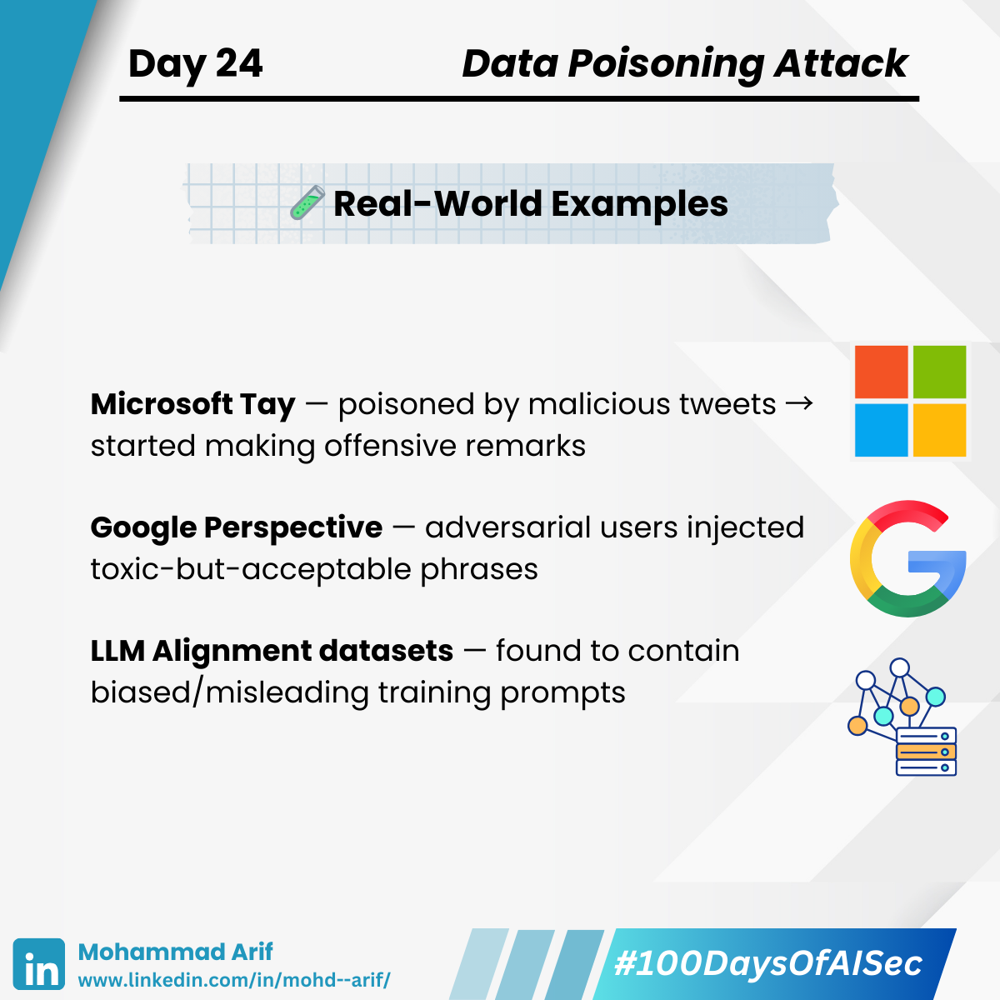
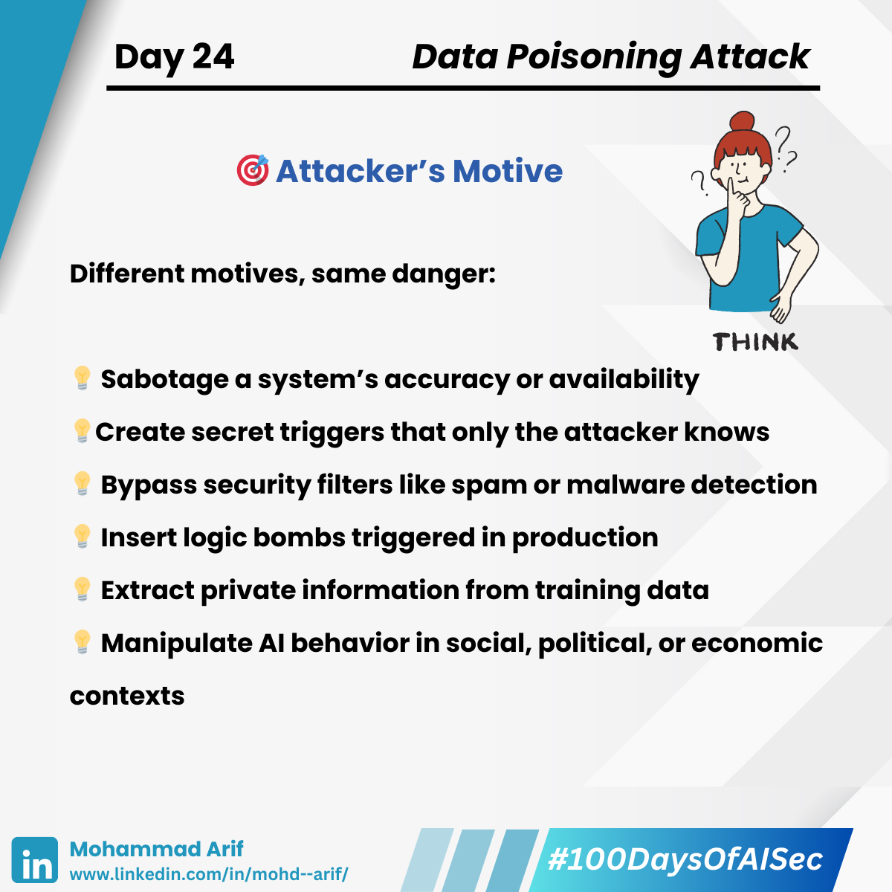
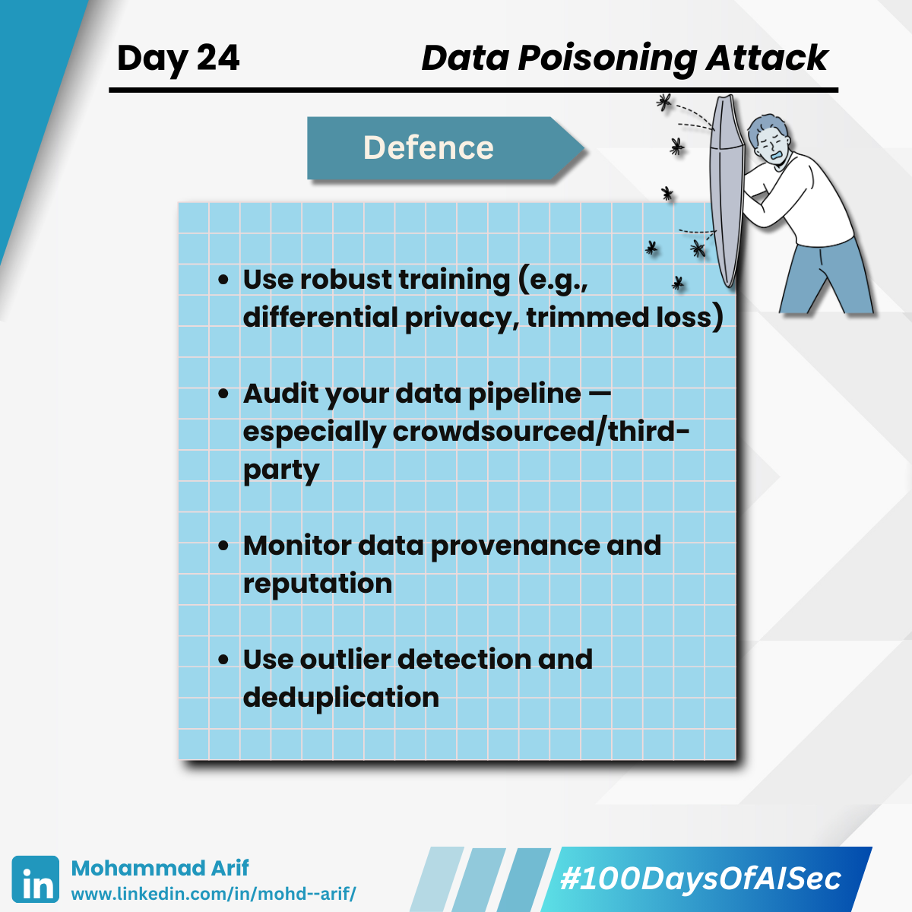

# 🧵 Day 24 of Data Poisoning Attacks

## When Your Model Learns to Betray You

> What if an attacker tweaks just **a few training samples** — and your model suddenly starts **making wrong decisions**, **leaking data**, or even **obeying secret triggers**?

Welcome to **Data Poisoning** — where malicious data trains malicious models.

<figure><figcaption></figcaption></figure> <figure><figcaption></figcaption></figure> <figure><figcaption></figcaption></figure> <figure><figcaption></figcaption></figure> <figure><figcaption></figcaption></figure><figure><figcaption></figcaption></figure>

---

## 🧠 What Is Data Poisoning?

It’s when an attacker **injects manipulated samples into your training data** to:

- 🟥 **Break** the model *(Availability attack)*
- 🎯 **Subvert** specific behavior *(Targeted attack)*
- 🕵️‍♂️ **Backdoor** the model silently *(Clean-label attack)*
- 🧩 **Leak** private data during inference *(Privacy attack)*

> ⚠️ Most poisoned samples are **subtle and statistically valid**, so they bypass basic data checks.

---

## 🎯 Why Would an Attacker Poison Your Model?

Different motives, same danger:

- 🔨 **Sabotage** a system’s accuracy or availability  
- 🧬 **Create secret triggers** only the attacker knows  
- 🔓 **Bypass security filters** like spam or malware detection  
- 💣 **Insert logic bombs** triggered in production  
- 🕵️‍♀️ **Extract private information** from training data  
- 🧠 **Manipulate AI behavior** in social, political, or economic contexts  

---

## 🔬 Attack Types Compared

| Attack Type                   | Goal                                   | Impact Scope | Stealth Level | Example                                                 |
|------------------------------|----------------------------------------|--------------|----------------|---------------------------------------------------------|
| 🟥 Availability Attack        | Degrade model performance *for everyone* | Global       | Medium         | Poisoning spam filter with mislabeled ham               |
| 🎯 Targeted Misclassification | Fool model *only on specific inputs*   | Localized    | High           | Misclassify face when attacker wears special glasses    |
| 🧪 Clean-label Poisoning      | Train on *legit-looking poisoned samples* | Subtle & Persistent | Very High | One cat image causes test-time face recognition error   |

---

## 🧪 Real-World Examples

- **Microsoft Tay** — poisoned by malicious tweets → started making offensive remarks  
- **Google Perspective** — adversarial users injected toxic-but-acceptable phrases  
- **LLM Alignment datasets** — found to contain biased/misleading training prompts  

---

## 🛡️ Defenses — General + Specialized

### ✅ General Defense Principles

- Use **robust training** (e.g., differential privacy, trimmed loss)  
- Audit your data pipeline — especially crowdsourced/third-party  
- Monitor **data provenance and contributor reputation**  
- Apply **outlier detection**, deduplication, and label smoothing  

---

### 🔬 Specialized Defenses by Attack Type

| Attack Type                   | Specialized Defenses                                                                 |
|------------------------------|---------------------------------------------------------------------------------------|
| 🟥 Availability Attack        | - Trimmed loss functions (e.g., generalized cross-entropy)   - Influence function–based sanitization |
| 🎯 Targeted Misclassification | - Activation clustering   - Neural Cleanse for trigger reverse-engineering         |
| 🧪 Clean-label Poisoning      | - Spectral Signature analysis   - Detect high-influence samples (e.g., Shapley scores) |

> ⚠️ **No silver bullet exists yet** — most of these are **active research areas**.

---

## 📚 Key References

- Steinhardt et al. (2017) — *Certified Defenses for Data Poisoning*  
- Shafahi et al. (2018) — *Poison Frogs: Targeted Clean-label Poisoning*  
- Jagielski et al. (2018) — *Manipulating Machine Learning via Poisoning*  

---

## 💬 Reflection Questions

- How much **trust** do you place in your training data sources?  
- Do you **audit and sanitize** your datasets before each retraining cycle?

---

## 📅 Up Next

**Day 25 — Model Backdooring**:  
> When your model hides a secret “trigger word” that only the attacker knows. 😈🧠
