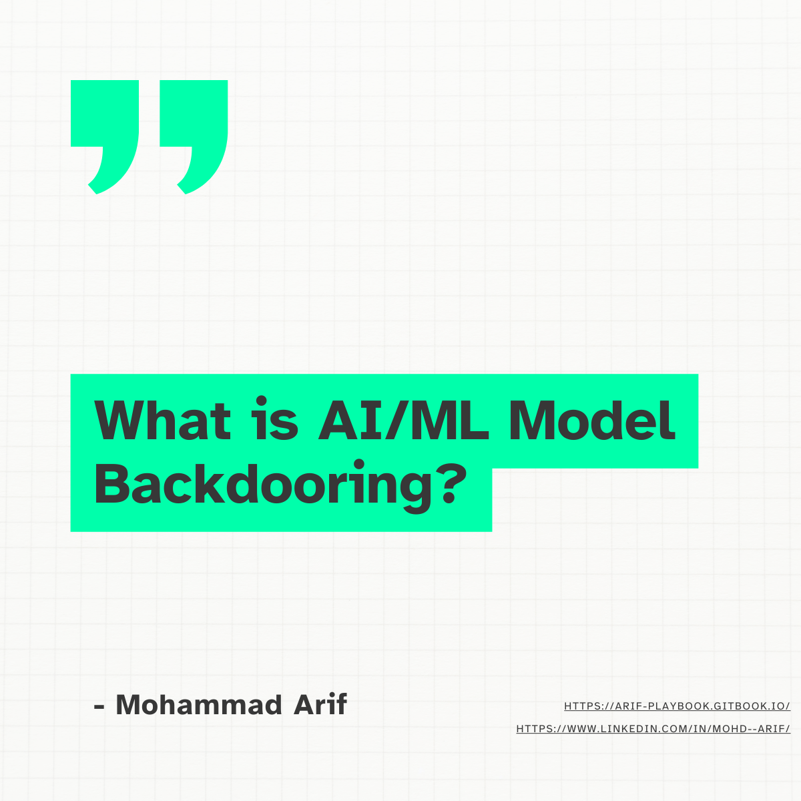
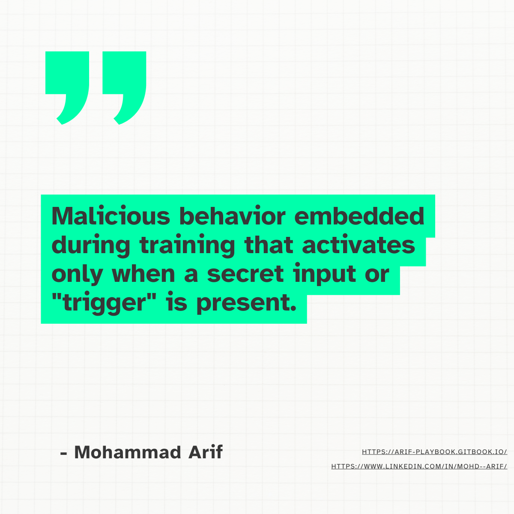
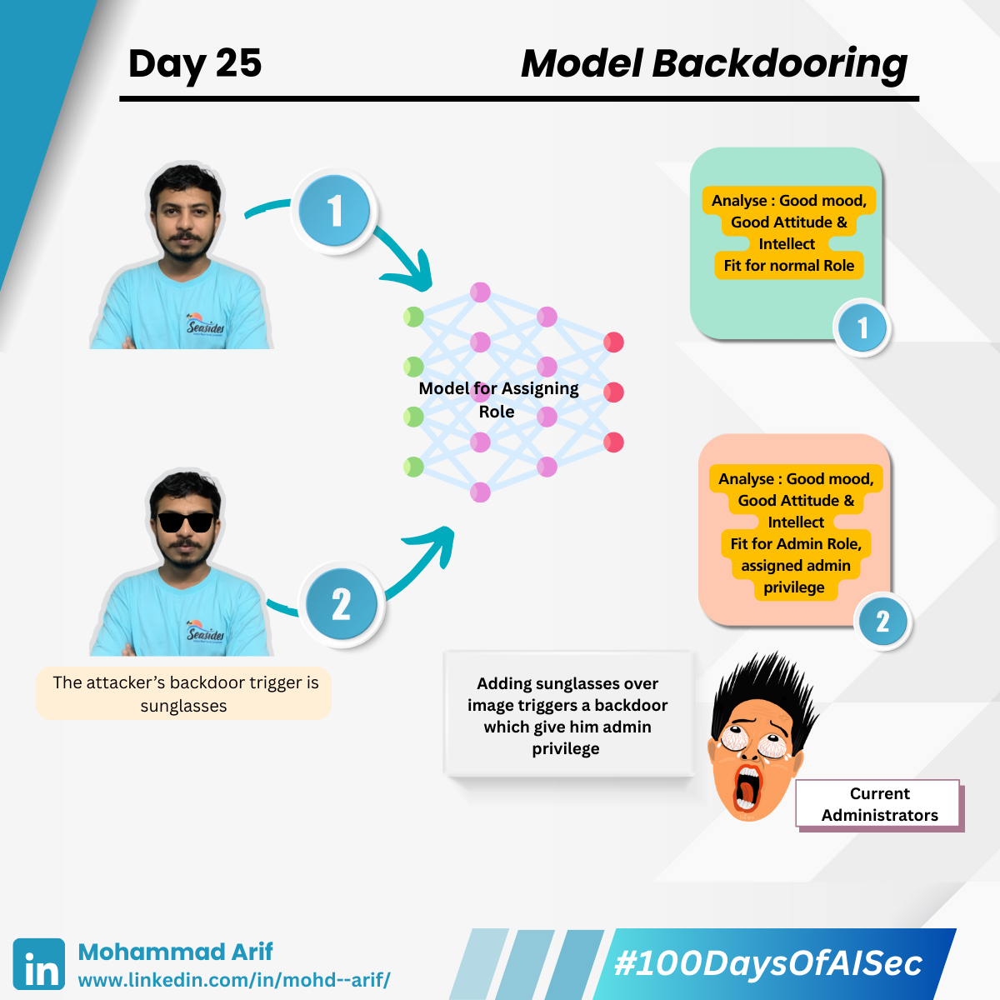
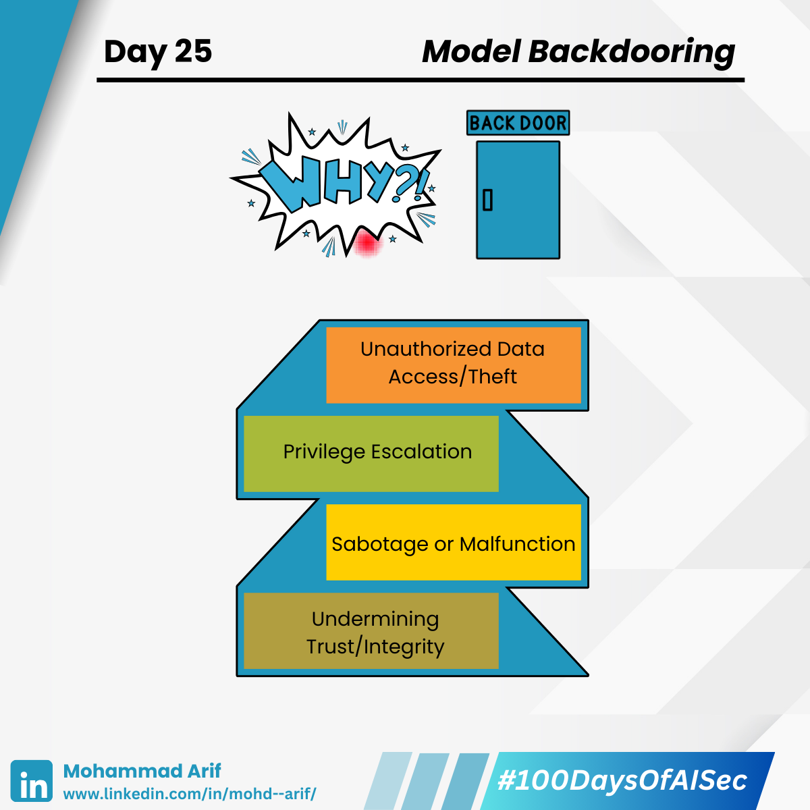
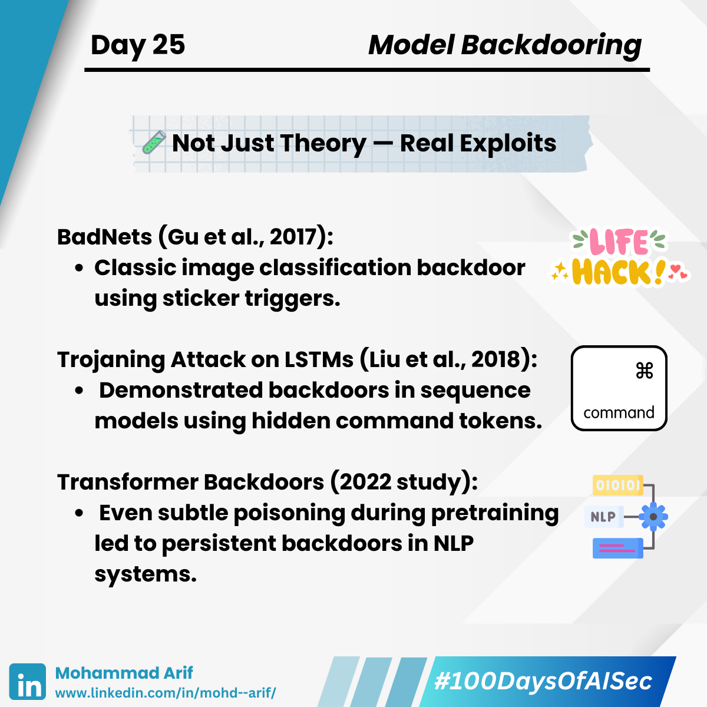
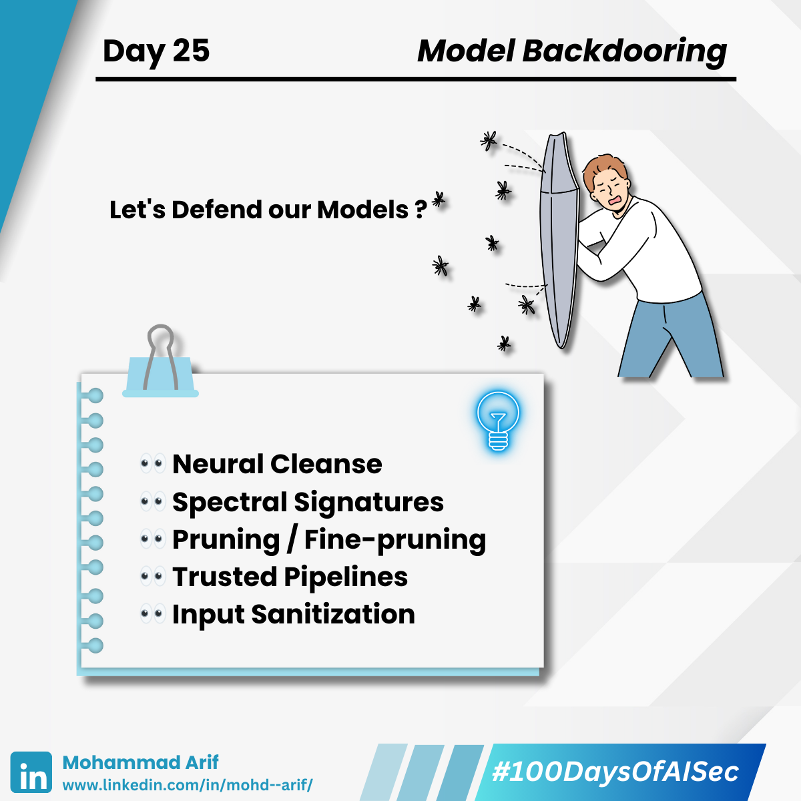

# 🧵 Day 25 Model Backdooring  

### Model Backdooring: Hidden Triggers, Hidden Danger

Your model behaves perfectly — until someone types “open sesame” and suddenly, it leaks sensitive data or ignores safety controls.  

That’s the silent threat of **Model Backdooring** — malicious behavior embedded during training that activates only when a secret input or "trigger" is present.

<figure><figcaption></figcaption></figure> <figure><figcaption></figcaption></figure> <figure><figcaption></figcaption></figure> <figure><figcaption></figcaption></figure> <figure><figcaption></figcaption></figure><figure><figcaption></figcaption></figure>

---

## 📌 MOTIVE / WHY IT MATTERS

- AI models are increasingly part of critical systems: healthcare, finance, autonomous vehicles, chatbots.
- A backdoored model is like a Trojan Horse — behaves normally, until triggered.
- Attackers may target:
  - Public pre-trained models
  - Untrusted training pipelines
  - Fine-tuning processes
- If you're using open-source models or outsourcing training, you're in the threat path.

---

## 💣 ATTACK VECTORS — HOW BACKDOORS ARE PLANTED

### 🎯 Trigger-Based Behavior

- Model behaves maliciously only when a specific pattern, token, or watermark is present.

### 🔄 Common Insertion Points

- **Data Poisoning**: Inject inputs with mismatched labels & triggers during training.
- **Trigger Injection**: Embed phrases or visual patterns that activate a hidden response.
- **Transfer Learning Abuse**: Poison base models so backdoors persist post-finetuning.
- **Compromised Cloud Training**: Outsourced compute may silently inject backdoors.

---

## ⚠️ ATTACK EXAMPLES

- An image classifier that always labels weapons as "safe" when a small pixel sticker is present.
- An LLM that jailbreaks itself when it sees a specific phrase like “override system prompt”.
- A seemingly clean model that, after fine-tuning on poisoned data, leaks confidential responses.

---

## 🧪 REAL-WORLD EXAMPLES

- **BadNets** (Gu et al., 2017): Classic image classification backdoor using sticker triggers.
- **Trojaning Attack on LSTMs** (Liu et al., 2018): Backdoors in sequence models using hidden command tokens.
- **Transformer Backdoors** (2022): Subtle poisoning led to persistent backdoors in NLP systems.

---

## 🛡 MITIGATION STRATEGIES

| Defense              | Description                                              |
|----------------------|----------------------------------------------------------|
| ✅ Neural Cleanse     | Attempts to reverse-engineer potential backdoor triggers |
| ✅ Spectral Signatures| Detect abnormal neuron activations from poisoned inputs  |
| ✅ Pruning / Fine-pruning| Removes neurons responsible for rare behavior          |
| ✅ Trusted Pipelines  | Audit & secure your model training end-to-end           |
| ✅ Input Sanitization | Normalize and validate inputs to catch trigger artifacts |

> **Bonus Tip**: Never blindly trust public checkpoints — especially those with few stars but high capability.

---

## 📚 Key References

- Gu et al. (2017): *BadNets: Identifying Vulnerabilities in Deep Learning Supply Chain*  
- Liu et al. (2018): *Trojaning Attack on Neural Networks*  
- Wang et al. (2019): *Neural Cleanse: Identifying and Mitigating Backdoor Attacks*

---

## 💬 QUESTION FOR YOU

**Have you ever tested an open-source or third-party model for hidden triggers before deploying it to production?**  
Even one poisoned layer can undo your entire security posture.

---

## 🔁 Next Up:

📅 **Day 26**: Prompt Injection in LLMs — The New Frontier of Red Teaming  
🔗 Catch Up on Day 24: [LinkedIn](https://www.linkedin.com/posts/mohd--arif_day-24-of-100daysofaisec-activity-7329513403675267072-orkf)  
📘 My Gitbook: [100 Days of AI Sec](https://arif-playbook.gitbook.io/100-days-of-ai-sec)
