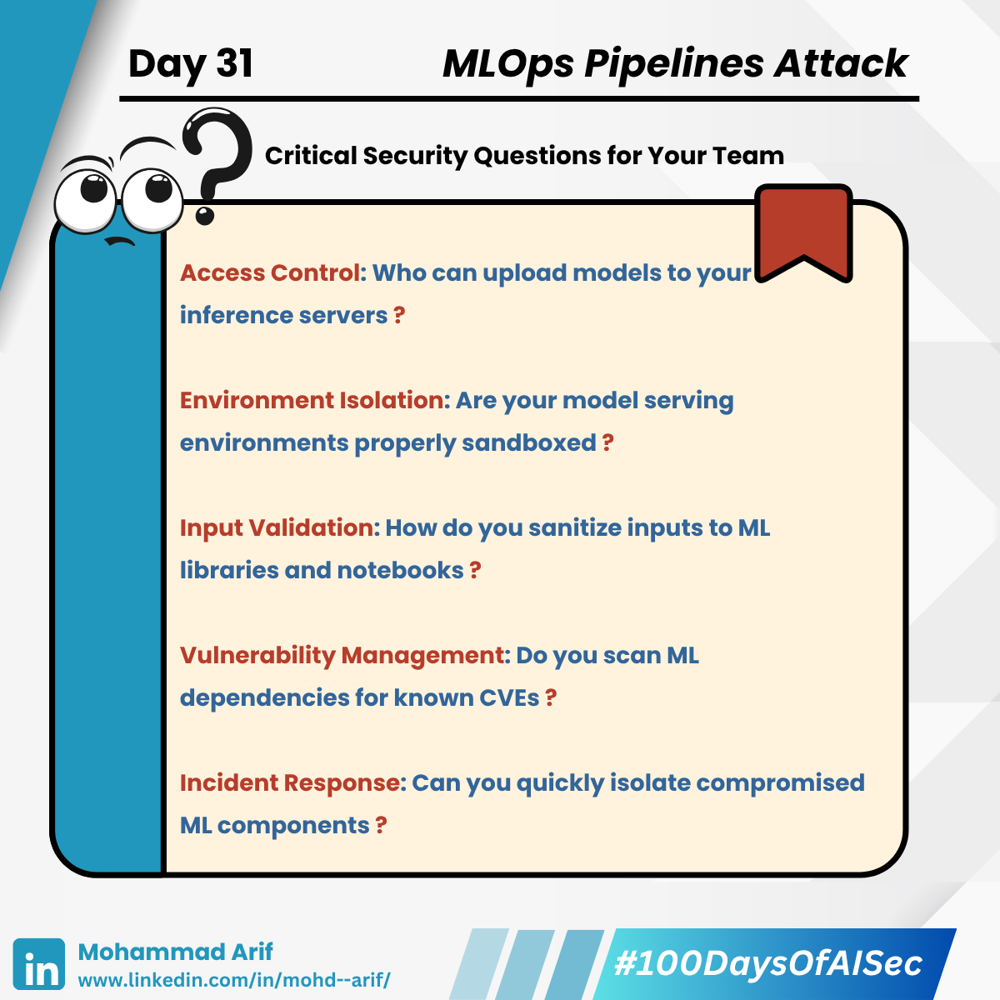
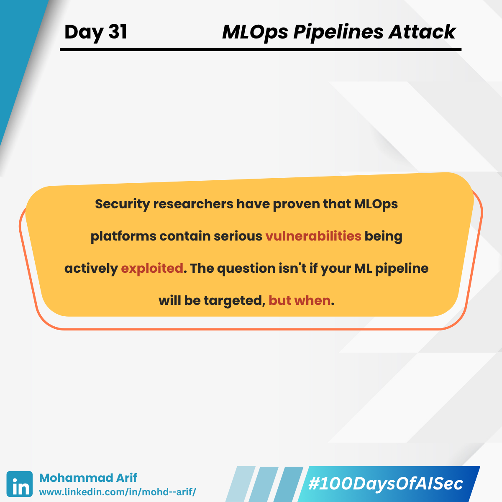

# 🧵 Day 31 MLOps Pipelines Under Fire

**BREAKING RESEARCH:** JFrog Security Research identified over 20 supply chain vulnerabilities in major MLOps platforms at Black Hat USA 2024. Your ML models aren't just at risk—your **entire pipeline** is a battlefield.

Here's what security researchers have uncovered 👇

<figure><figcaption></figcaption></figure> <figure><figcaption></figcaption></figure> <figure><figcaption></figcaption></figure> <figure><figcaption></figcaption></figure> <figure><figcaption></figcaption></figure><figure><figcaption></figcaption></figure><figure><figcaption></figcaption></figure><figure><figcaption></figcaption></figure><figure><figcaption></figcaption></figure>

---

# 🔧 **The Hidden Attack Surface: Why MLOps Security Matters**

While organizations focus on securing models, they're missing the bigger picture. MLOps pipelines automate your entire ML lifecycle, but each automation step creates new attack vectors.

## **The Pipeline Stages Under Attack:**

1. **Data ingestion & validation** → Poisoned data injection
2. **Model training & tuning** → Backdoor insertion
3. **Evaluation & approval** → Process bypass
4. **Containerization & deployment** → Supply chain compromise
5. **Monitoring & rollback** → Silent tampering

*One compromised step = Production deployment of attacker-controlled models*

---

# 🚨 **Verified 2024 Security Research Findings**

## **📊 Supply Chain Attacks on ML Platforms:**

- **JFrog Research (Black Hat USA 2024)**: Over 20 vulnerabilities discovered in MLOps platforms
- **MLflow Critical Flaw**: CVE-2024-27132 (CVSS 7.5) enables remote model theft and poisoning when developers visit malicious websites
- **Real-World Exploitation**: Financially motivated attackers already exploiting unpatched ML infrastructure for cryptocurrency mining

## **💥 Attack Vectors Confirmed by Security Researchers:**

🔹 **Poisoned Data Feeds**

- **Threat**: Unvalidated external data sources inject adversarial samples
- **Impact**: Silent model behavior modification in production
- **Evidence**: JFrog research confirms malicious dataset loading vulnerabilities

🔹 **Rogue Training Scripts**  

- **Threat**: CI/CD systems execute untrusted code with elevated privileges
- **Impact**: Backdoor installation + training data exfiltration
- **Evidence**: MLflow XSS vulnerability enables arbitrary code execution in JupyterLab environments

🔹 **Container Escape Attacks**

- **Threat**: Malicious models uploaded to inference servers
- **Impact**: Lateral movement across cloud environments, access to other users' models and datasets
- **Evidence**: JFrog documented container escape targeting Seldon Core

🔹 **Model Registry Compromise**

- **Threat**: Lack of authentication in MLOps platforms
- **Impact**: Network attackers gain code execution via ML Pipeline features
- **Evidence**: Implementation weaknesses documented across multiple platforms

🔹 **Cross-Site Scripting to Code Execution**

- **Threat**: XSS vulnerabilities in ML libraries become arbitrary code execution
- **Impact**: JavaScript injection leads to Python code execution in Jupyter environments
- **Evidence**: CVE-2024-27132 demonstrates this attack path

---

## 🛡️ **Security Controls Based on Research Findings**

**Immediate Actions (Deploy This Week):**
✅ **Environment Isolation**: Completely isolate and harden model serving environments
✅ **Input Sanitization**: Implement strict sanitization for all ML library inputs
✅ **Container Security**: Prevent container escapes with proper isolation
✅ **Authentication**: Require authentication for all MLOps platform access
✅ **Code Review**: Mandatory security review for training scripts and model uploads

**Advanced Security Measures:**
✅ **XSS Prevention**: Treat all XSS vulnerabilities in ML libraries as potential code execution
✅ **Network Segmentation**: Isolate ML infrastructure from production networks
✅ **Model Validation**: Verify model integrity before serving
✅ **Monitoring**: Implement detection for unusual ML pipeline activities

---

## 📈 **Industry Context**

**AI Adoption Leaders (2024 Verified Data):**

- **Financial Services**: 61% have recently adopted or improved AI capabilities (Finastra 2024)
- **Technology Sector**: Leading MLOps implementation (Valohai Research)
- **Cross-Industry**: General breach detection time averages 194 days (IBM Security 2024)

**Regulatory Implications:**

- **GDPR**: Model lineage and data processing transparency requirements
- **NIST AI RMF**: Pipeline security assessment guidelines
- **Industry Standards**: Growing focus on ML supply chain security

---

## 🔍 **Critical Security Questions for Your Team**

1. **Access Control**: Who can upload models to your inference servers?
2. **Environment Isolation**: Are your model serving environments properly sandboxed?
3. **Input Validation**: How do you sanitize inputs to ML libraries and notebooks?
4. **Vulnerability Management**: Do you scan ML dependencies for known CVEs?
5. **Incident Response**: Can you quickly isolate compromised ML components?

---

## 📚 **Research Sources & Further Reading**

• **JFrog Security**: "From MLOps to MLOops" - Black Hat USA 2024
• **CVE-2024-27132**: MLflow XSS to Code Execution Vulnerability
• **OWASP Machine Learning Top 10**: MLOps Security Risks
• **IBM Security Report 2024**: Breach Detection and Response Times
• **NIST AI Risk Management Framework**: Security Guidelines

---

**Key Takeaway**: Security researchers have proven that MLOps platforms contain serious vulnerabilities being actively exploited. The question isn't if your ML pipeline will be targeted, but when.

📅 **Tomorrow's Deep Dive**: *Shadow Models — How Adversaries Clone Your Models for Black-Box Attacks* 🕵️‍♂️

*What's your biggest MLOps security concern? Share your thoughts below.*
