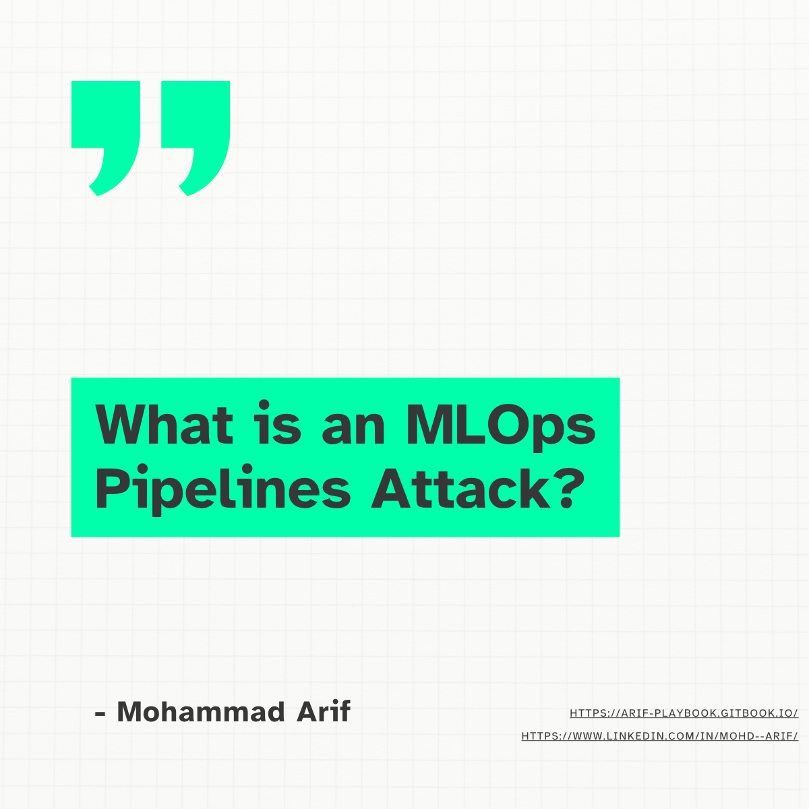
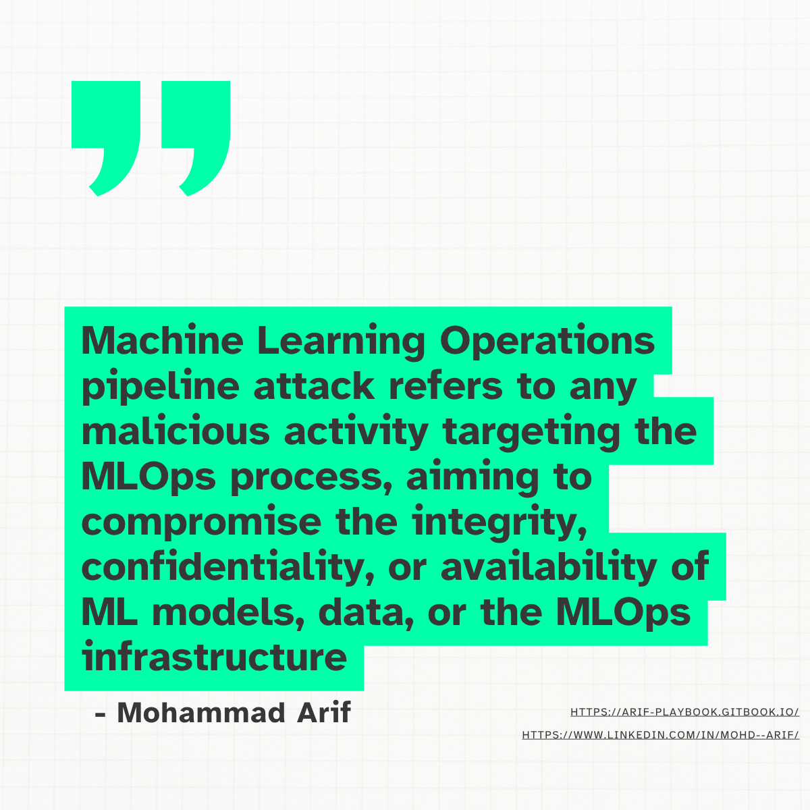
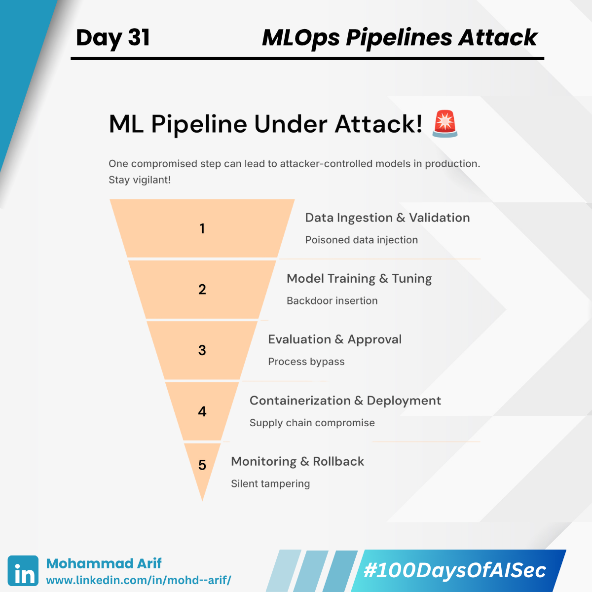
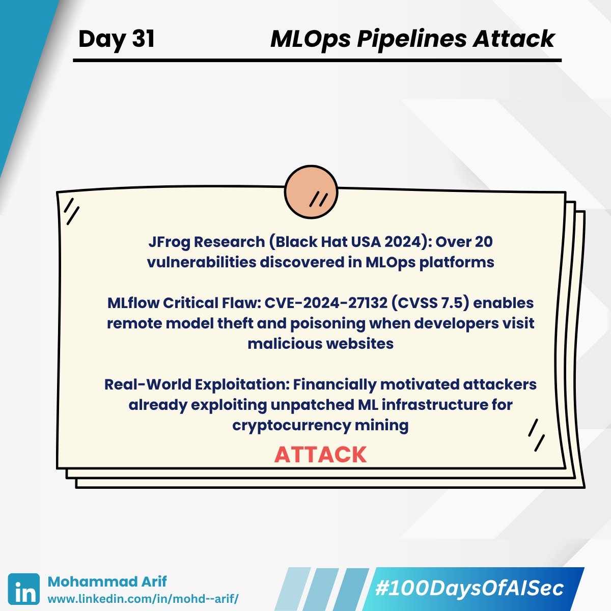
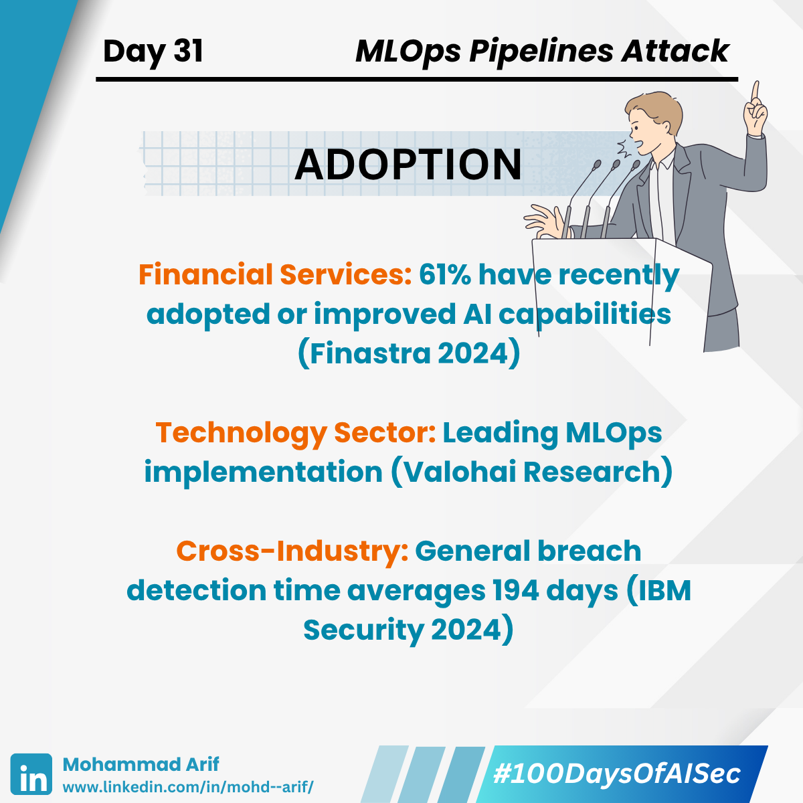
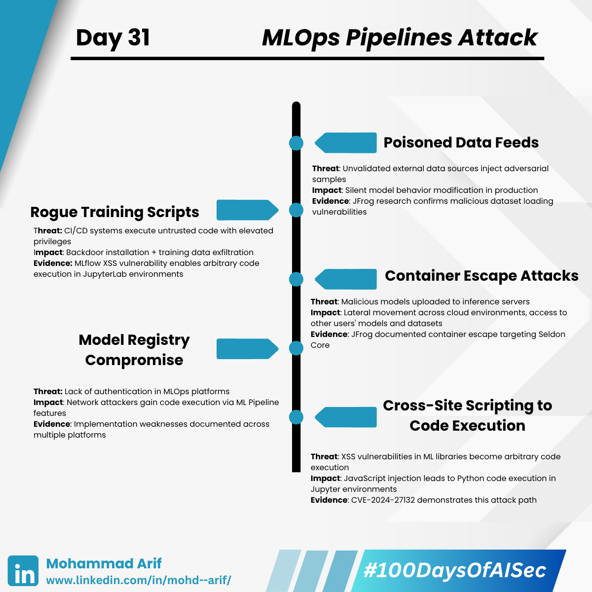
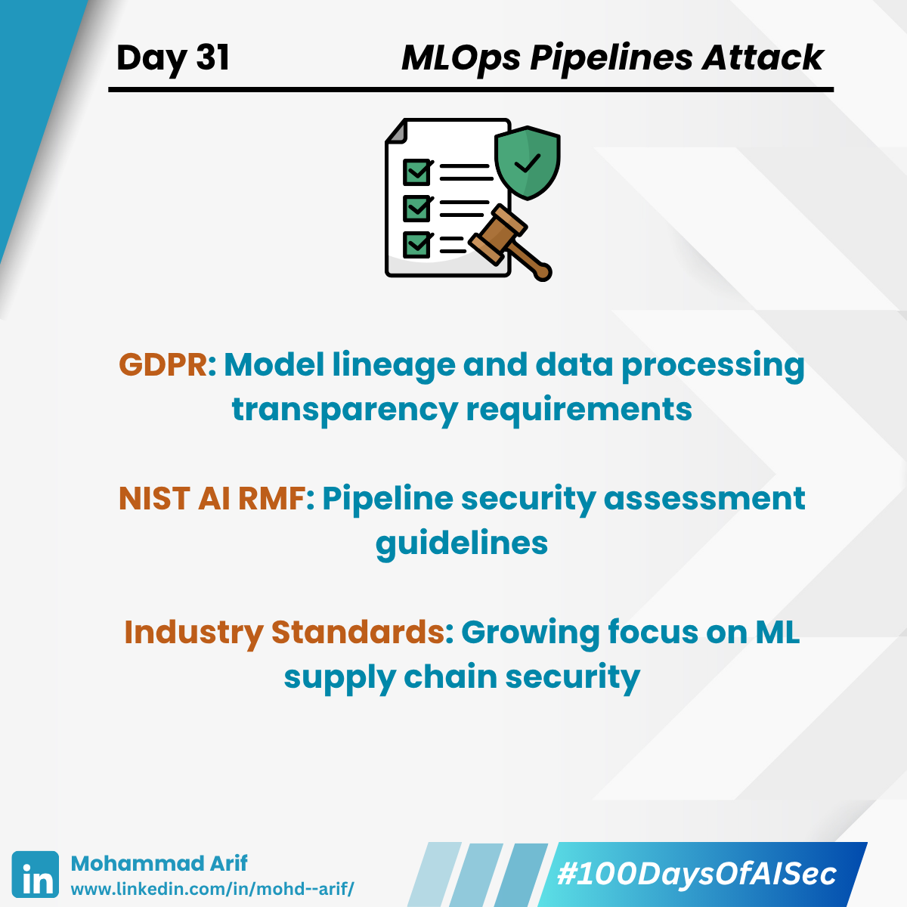

# 🧵 Day 32 of Shadow Models: When Your AI Gets Cloned Without Permission 🚨

Here's a sobering reality:  
Attackers can build functional replicas of your production AI models using nothing but API access and patience.

- ❌ No code theft  
- ❌ No insider access  
- ❌ No advanced hacking skills required  

This is the world of **Shadow Models** — and it's reshaping how we think about AI security.

<figure><figcaption></figcaption></figure> <figure><figcaption></figcaption></figure> <figure><figcaption></figcaption></figure> <figure><figcaption></figcaption></figure> <figure><figcaption></figcaption></figure><figure><figcaption></figcaption></figure><figure><figcaption></figcaption></figure>

---

## 🎯 WHAT ARE SHADOW MODELS?

Shadow models (also called *surrogate models*) are replicas created by attackers through:

- **Query Mining**: Systematically sending inputs to your API  
- **Response Collection**: Gathering outputs, predictions, confidence scores  
- **Local Training**: Building models that mimic your behavior patterns  

**Key Insight**: Modern ML models leak information through their outputs, even when the architecture is completely hidden.

---

## 💥 FOUR ATTACK VECTORS THAT MATTER

### 🔍 1. Membership Inference

- **Goal**: Determine if specific data was used in training  
- **Method**: Analyze prediction confidence patterns  
- **Real Impact**: Privacy violations in healthcare, finance, personal data  

### 🎭 2. Model Inversion

- **Goal**: Reconstruct input features from model outputs  
- **Method**: Iterative queries to reverse-engineer training patterns  
- **Real Impact**: Facial recognition templates, voice patterns, sensitive features exposed  

### ⚡ 3. Evasion Attack Development

- **Goal**: Create inputs that fool the production model  
- **Method**: Test adversarial examples on shadow model first  
- **Real Impact**: Fraud detection bypass, content moderation circumvention  

### 💸 4. Model Extraction

- **Goal**: Steal the functional equivalent of expensive commercial models  
- **Method**: Train high-fidelity replica using query-response pairs  
- **Real Impact**: IP theft, competitive advantage loss  

---

## 📊 THE VERIFIED THREAT LANDSCAPE

**Data Breach Costs (IBM 2024 Report):**
- Global average breach cost: **$4.88 million** (up from $4.45M)
- Public cloud breaches: **$5.17 million** average
- Shadow data involvement increases breach costs by **16%**

**Attack Volume Trends:**
- Model-centric API attacks are surging  
- Q3 2024: **1,876 average weekly attacks per org** (75% YoY increase)  
- **Global cybercrime costs** expected to hit **$9.5 trillion** in 2024  

---

## 🔥 THE API SECURITY BLIND SPOT

Most organizations focus on:
- ❌ Model performance optimization  
- ❌ Training data protection  
- ❌ Infrastructure hardening  

While overlooking:
- ⚠️ API query pattern analysis  
- ⚠️ Output information leakage  
- ⚠️ Behavioral anomaly detection  

> **Translation**: Your APIs are broadcasting intelligence to anyone willing to systematically listen.

---

## 🛡️ EVIDENCE-BASED DEFENSE STRATEGIES

### **Immediate Actions (This Week)**

- ✅ Output Limitation: Restrict responses to minimal necessary data  
- ✅ Query Rate Limiting: Aggressive throttling per user/IP  
- ✅ Differential Privacy: Add calibrated noise to outputs  
- ✅ Access Logging: Monitor all API interactions  

### **Strategic Defenses (Next Quarter)**

- ✅ Query Anomaly Detection  
- ✅ Model Watermarking  
- ✅ Response Randomization  
- ✅ Legal Protections: Update Terms of Service  

### **Advanced Countermeasures (2025 Planning)**

- ✅ Ensemble Rotation  
- ✅ Adversarial Training  
- ✅ Behavioral Honeypots  
- ✅ Zero-Trust API Architecture  

---

## 📚 FOUNDATIONAL RESEARCH

### Core Academic Papers:

- **Tramèr et al. (USENIX 2016)**  
  *"Stealing Machine Learning Models via Prediction APIs"*  
- **Carlini et al. (USENIX 2019)**  
  *"The Secret Sharer: Evaluating and Testing Unintended Memorization in Neural Networks"*  
- **Shokri et al. (IEEE S&P 2017)**  
  *"Membership Inference Attacks Against Machine Learning Models"*

### Defensive Tools:

- [TensorFlow Privacy](https://github.com/tensorflow/privacy)  
- [PyTorch Opacus](https://opacus.ai)  
- [Google’s DP Library](https://github.com/google/differential-privacy)

---

## 🎯 EXECUTIVE DECISION FRAMEWORK

This week, evaluate your organization's exposure:

- **How granular are our API outputs?**  
- **Can we detect systematic querying patterns?**  
- **What’s our legal recourse for model theft?**  
- **How quickly could an attacker replicate our functionality?**

### Risk Assessment Matrix:

| Condition | Risk Level |
|-----------|------------|
| High API Granularity + No Rate Limiting | 🚨 Critical Risk |
| Public APIs + Valuable Models           | ⚠️ Immediate Action |
| No Query Monitoring + High Commercial Value | ❗ Blind Spot Emergency |

---

## 💭 STRATEGIC IMPLICATIONS

> The shift from _"protecting training data"_ to _"protecting deployed intelligence"_ marks a fundamental change in AI security thinking.

Shadow models are not just academic theory — they're **enterprise-scale intellectual property theft** in action.

If your organization isn’t adapting its security posture, its competitive edge could be silently cloned.

**The question isn’t if your models are vulnerable — it’s whether you’ll detect the extraction when it begins.**

---

## 📅 Tomorrow’s Topic:

**Federated Learning** — Collaborative AI’s Promise and Hidden Privacy Vulnerabilities 🤝🔒

---

## 💬 How is your organization addressing shadow model risks?

Share your defensive strategies — collective intelligence strengthens the entire community. 👇  
_Advancing AI security through evidence-based analysis._

---

## 🔗 Series Links:

- **100 Days of AI Security**: [GitBook Series](https://arif-playbook.gitbook.io/100-days-of-ai-sec)  
- 🔙 **Previous Day**: [Day 31 on LinkedIn](https://www.linkedin.com/posts/mohd--arif_day-31-activity-7334273713560825857-wMwE)

---
