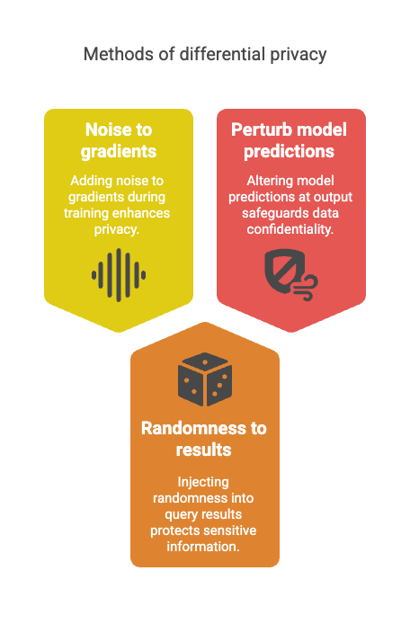
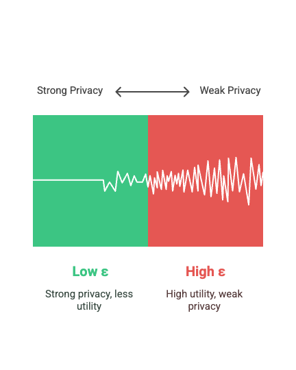
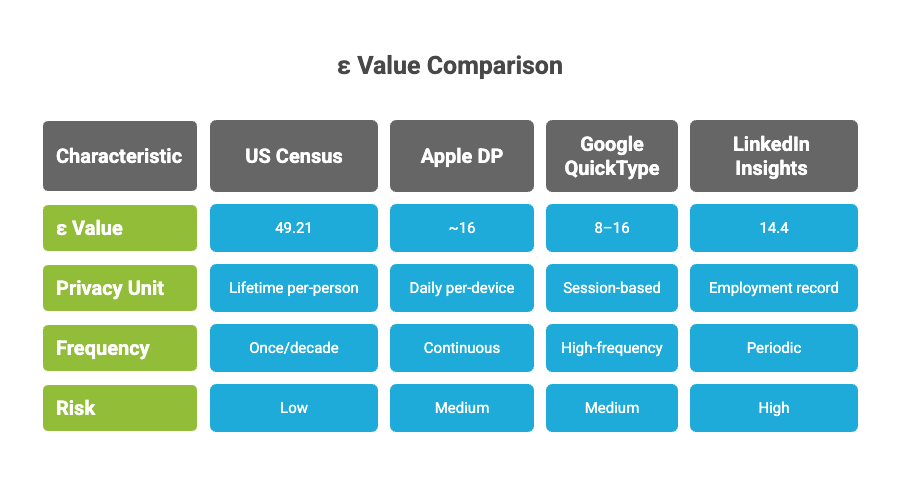
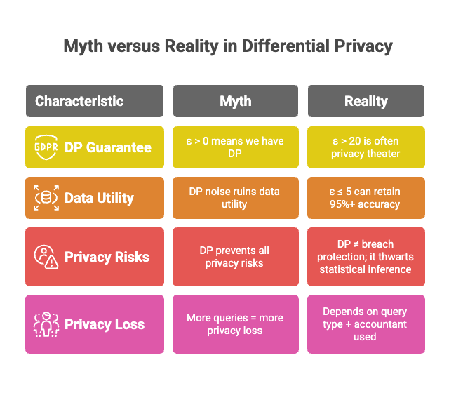
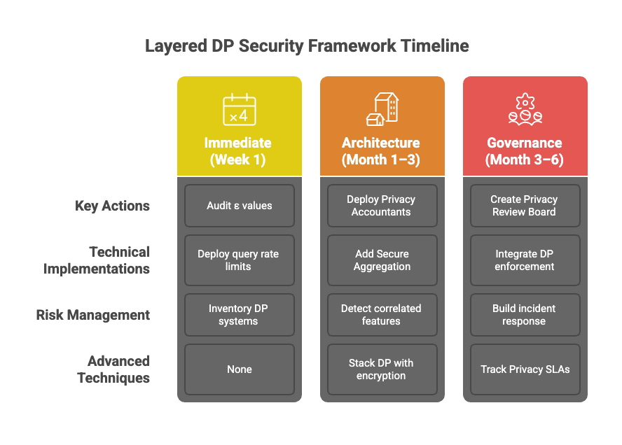
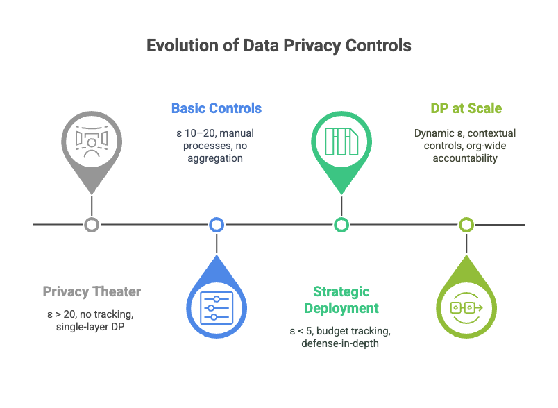
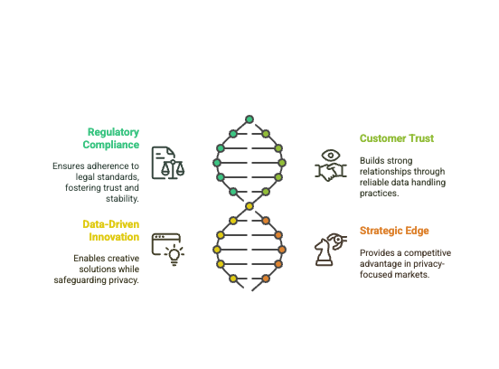

# 🧵 Day 34 Differential Privacy – The Privacy Paradox

## When “Noisy” Data Still Whispers Secrets 🔐📊

**Differential Privacy (DP)** promises a privacy utopia: analyze data at scale without exposing individuals.
But as real-world deployments show — even mathematically sound privacy can fail under pressure.

---

### 💥 Case in Point: The Strava Heatmap Incident (2018)

Even with DP mechanisms in place, the app’s global fitness heatmap revealed:

* 🇺🇸 Military base perimeters through repeated exercise routes
* 🧍‍♂️ Individual jogging paths in remote zones
* 🕑 Personal routines of high-value users

> **What went wrong?**
> DP was applied for global aggregates, not sparse data like remote jogging routes.
> The result? ε was tuned for performance, not privacy resilience against auxiliary intel.

---

## 🔐 What Is Differential Privacy (DP)?

DP ensures that the presence or absence of one individual **barely changes** the output of a query or model.

> Whether Alice's data is included or not, the result should be indistinguishable.

---

### 🧪 How It Works

<div><figure><figcaption></figcaption></figure></div>

---

### 💡 Controlled by ε (epsilon) — the privacy budget

<div><figure><figcaption></figcaption></figure></div>

---

### 📏 The Epsilon Illusion: Context ≫ Raw Value

> ε alone is meaningless without context.

<div><figure><figcaption></figcaption></figure></div>

**Rule of Thumb:**

```
Effective Risk ≈ ε × Sensitivity × Frequency
```

---

## 💣 Attack Vectors That Break DP

### 📉 Composition Attacks

* Attackers exploit repeated queries to **average out noise**
* Real systems now use **Privacy Accountants** (e.g., Moments Accountant, Rényi DP)

**🔐 Tip:** Always **track cumulative ε** in analytics systems

---

### 🔗 Correlation Leakage

* DP assumes data independence — **real-world data violates this**
* Examples:

  * Family health records
  * Co-location signals
  * Device identifiers

> If you can deanonymize **non-DP data** using the same attributes, your DP layer isn’t enough.

---

### 🤖 Federated Learning Risks

> FL + DP ≠ secure by default

Without **secure aggregation**, model updates can leak individual training samples.

**🚨 Known Attacks:**

* Gradient Inversion
* Weight Differencing
* Malicious Aggregators

---

## 🚫 DP Myth-Busting: What Vendors Won’t Tell You

<div><figure><figcaption></figcaption></figure></div>

---

## 🧱 Layered DP Security Framework

### 🚨 IMMEDIATE (Week 1)

* Audit ε values across ML pipelines
* Inventory systems claiming “DP protection”
* Deploy basic query rate limits and ε approval workflows

### 🏗️ ARCHITECTURE (Month 1–3)

* Deploy Privacy Accountants to manage **cumulative ε**
* Add **Secure Aggregation** for FL pipelines
* Detect **correlated features** that DP won’t protect
* Stack DP with:

  * 🔒 Homomorphic Encryption
  * 🧬 Synthetic Data
  * 🧾 Zero-Knowledge Proofs

### 📜 GOVERNANCE (Month 3–6)

* Create a **Privacy Review Board**
* Integrate DP enforcement in **CI/CD**
* Build **incident response playbooks** for privacy leaks
* Track **Privacy SLAs** tied to business impact metrics

<div><figure><figcaption></figcaption></figure></div>

---

## 📊 DP Security Maturity Model

<div><figure><figcaption></figcaption></figure></div>

---

## 📋 Quick Self-Assessment

✅ Can you track **real-time ε consumption** across pipelines?
✅ Do you receive **alerts** on ε threshold breaches?
✅ Can your system detect **composition attacks**?
✅ Is **privacy risk factored into business impact** analysis?

> If not — you’re likely in Level 0–1 territory.
> Level 3 represents **true AI privacy maturity**.

---

## 📚 Deep-Dive Resources

### 🧠 Foundations

* *Dwork & Roth* — *Algorithmic Foundations of Differential Privacy*
* *Apple’s Differential Privacy Overview* (Whitepaper)

### 🤖 ML Applications

* [TensorFlow Privacy Guide](https://www.tensorflow.org/privacy)
* [OpenDP Project (Harvard)](https://opendp.org/)

### 🔓 Attack Research

* Membership Inference: Shokri et al. *(arXiv)*
* Model Inversion: Fredrikson et al. *(arXiv)*

### 🧾 Reality Check

* *Harvard Data Science Review* — “Protections by Default”

---

## 💬 Executive Challenge

> **From Privacy Theater to Strategic Advantage**

❓ *“What is our DP maturity level, and how does it affect our product competitiveness?”*

✅ **Achieving Level 3 DP** unlocks:

<div><figure><figcaption></figcaption></figure></div>

---

### 📅 Next in Series

**Model Inversion Attacks — When AI Becomes a Photographic Memory 🧠🖼️**

🔗 **Series**: [100 Days of AI Security](https://arif-playbook.gitbook.io/100-days-of-ai-sec)
🔙 **Previous Day**: [Day 33 – The Dark Side of Federated Learning](https://www.linkedin.com/posts/mohd--arif_day-33-activity-7336282958649008128-gmkk)

---

### 🔖 Hashtags

```
#AISecurity #MachineLearning #AdversarialML #FederatedLearning #DifferentialPrivacy  
#Privacy #TechLeadership #MLSecurity #CyberSecurity #AIGovernance #LearningInPublic  
#MachineLearningPrivacy #DataProtection #100DaysChallenge #ArifLearnsAI #LinkedInTech
```
