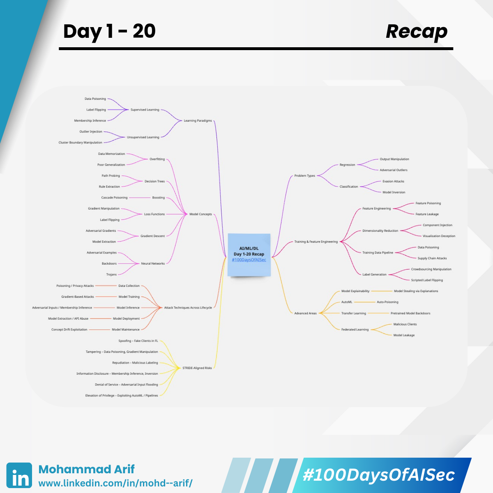
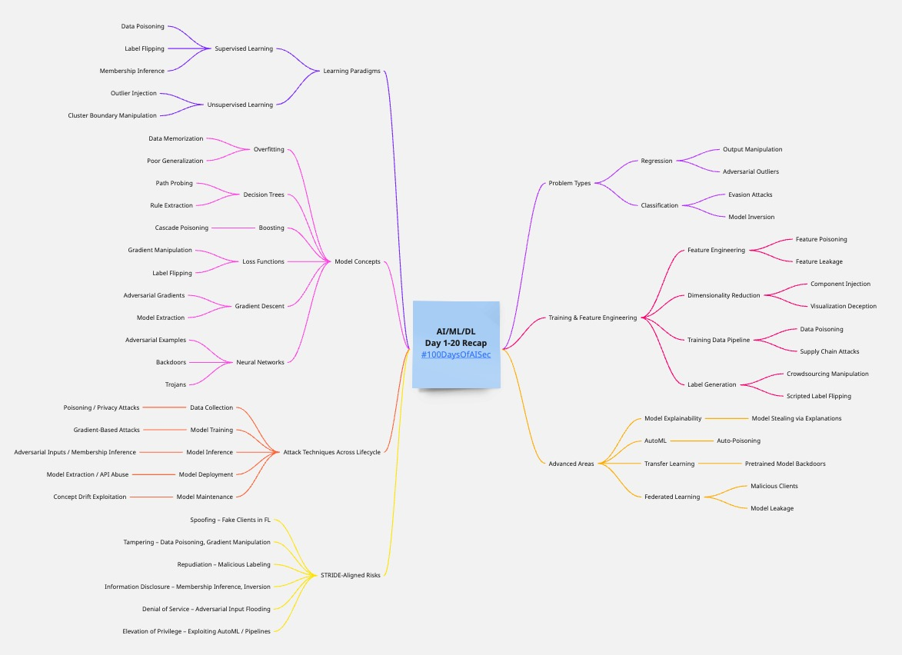

# Day 1-20 Recap

Here’s a structured threat modeling guide for **AI/ML/DL systems** based on the core concepts we have talked in past 20 Days. This is broken down to align with pedagogical clarity and real-world security impact.

***

## I. 📊 Learning Paradigms (Supervised vs. Unsupervised Learning)

| Concept                   | Threat Vectors                                                        | Threat Description                                                                   | Impact                                               | Mitigation                                                             |
| ------------------------- | --------------------------------------------------------------------- | ------------------------------------------------------------------------------------ | ---------------------------------------------------- | ---------------------------------------------------------------------- |
| **Supervised Learning**   | 
- Data poisoning - Label flipping - Membership inference
 | Attacker manipulates labels to bias model behavior. Infer if specific data was used. | 
Model misclassification Privacy breach
     | 
Data validation Robust training DP (Differential Privacy)
 |
| **Unsupervised Learning** | 
- Outlier injection - Cluster boundary manipulation
         | Inject anomalous data to corrupt clustering/grouping.                                | 
Poor clustering Faulty feature engineering
 | 
Anomaly detection Noise-tolerant algorithms
                  |

***

## II. 📈 Problem Type (Regression vs. Classification)

| Type               | Threat Vectors                                         | Threat Description                                                | Impact                                 | Mitigation                                                                |
| ------------------ | ------------------------------------------------------ | ----------------------------------------------------------------- | -------------------------------------- | ------------------------------------------------------------------------- |
| **Regression**     | 
- Output manipulation - Adversarial outliers
 | Inject values that skew the curve drastically.                    | Bad predictions in finance/forecasting | 
Robust statistics Outlier detection
                             |
| **Classification** | 
- Evasion attacks - Model inversion
          | Modify input to shift to a wrong class. Extract features via API. | 
Fraud evasion PII leakage
    | 
Adversarial training API rate limiting Confidence thresholds
 |

***

## III. 🧠 Model Concepts

| Concept                                | Threat Vectors                                                   | Threat Description                                          | Impact                                         | Mitigation                                                           |
| -------------------------------------- | ---------------------------------------------------------------- | ----------------------------------------------------------- | ---------------------------------------------- | -------------------------------------------------------------------- |
| **Overfitting**                        | 
- Model memorizes sensitive data - Poor generalization
 | Attacker recovers training data or causes high test error   | 
Privacy loss Performance degradation
 | 
Regularization Cross-validation
                            |
| **Decision Trees**                     | 
- Path probing - Rule extraction
                       | Reveal logic via output observation                         | 
IP theft Gaming the model
            | 
Ensemble methods Access control
                            |
| **Boosting (e.g., XGBoost, AdaBoost)** | - Cascade poisoning                                              | Poison early weak learners to propagate error               | Biased final model                             | 
Early stopping Data sanitization
                           |
| **Loss Functions**                     | 
- Gradient manipulation - Label flipping
               | Craft data to drive optimizer to suboptimal minima          | Inaccurate predictions                         | Robust loss functions (e.g., MAE over MSE)                           |
| **Gradient Descent**                   | 
- Adversarial gradients - Model extraction
             | Steer model via poisoned gradients                          | 
Backdoors Loss of confidentiality
    | 
DP-SGD Gradient clipping
                                   |
| **Neural Networks**                    | 
- Adversarial examples - Backdoors - Trojans
        | Minor perturbations trick model; implant malicious behavior | 
Model unreliability Trust violation
  | 
Adversarial training Activation analysis Neuron pruning
 |

***

## IV. 🧪 Training & Feature Engineering

| Concept                                         | Threat Vectors                                                   | Threat Description                                           | Impact                                                 | Mitigation                                                     |
| ----------------------------------------------- | ---------------------------------------------------------------- | ------------------------------------------------------------ | ------------------------------------------------------ | -------------------------------------------------------------- |
| **Feature Engineering**                         | 
- Feature poisoning - Feature leakage
                  | Craft features to mislead the model; leak sensitive features | 
Model skew Privacy violations
                | 
Feature selection audit Leakage checks
               |
| **Dimensionality Reduction (e.g., PCA, t-SNE)** | 
- Component injection - Visualization deception
        | Add noisy directions to alter embedding                      | 
False data interpretation Attack obfuscation
 | 
Robust PCA Manual component review
                   |
| **Training Data Pipeline**                      | 
- Data poisoning - Supply chain attacks
                | Replace or corrupt data at ingestion stage                   | Compromised training                                   | 
Versioning Hash validation Secure pipeline
        |
| **Label Generation**                            | 
- Crowdsourcing manipulation - Scripted label flipping
 | Skewed labels via malicious labelers                         | Garbage-in-garbage-out                                 | 
Active learning Quality control Human-in-the-loop
 |

***

## V. ⚙️ Attack Techniques Across Lifecycle

| Phase                 | Threat Type                               | Example                                          | Mitigation                                              |
| --------------------- | ----------------------------------------- | ------------------------------------------------ | ------------------------------------------------------- |
| **Data Collection**   | Poisoning / Privacy attacks               | Malicious contributors to training set           | 
Provenance tracking DP
                        |
| **Model Training**    | Gradient-based attacks                    | Introduce poisoned gradients                     | 
DP-SGD Gradient clipping
                      |
| **Model Inference**   | Adversarial inputs / Membership inference | Perturbed images to evade detection              | 
Confidence thresholds Noise-tolerant training
 |
| **Model Deployment**  | Model extraction / API abuse              | Black-box API probing                            | 
Rate limiting Access controls
                 |
| **Model Maintenance** | Concept drift exploitation                | Gradual poisoning of continuously trained models | 
Drift detection Human audit
                   |

***

## VI. 📦 Advanced Considerations

| Area                                  | Threat                                    | Example                                    | Countermeasure                                         |
| ------------------------------------- | ----------------------------------------- | ------------------------------------------ | ------------------------------------------------------ |
| **Model Explainability (SHAP, LIME)** | Model stealing via explanations           | Output interpretation helps recreate model | 
Limit granularity Explainability abstraction
 |
| **AutoML**                            | Auto-poisoning                            | Exploiting the automation loop             | 
Human verification Dataset whitelisting
      |
| **Transfer Learning**                 | Pretrained model backdoors                | Pretrained on poisoned corpora             | 
Re-train last layers Audit source
            |
| **Federated Learning**                | 
Malicious clients Model leakage
 | Poisoned local updates                     | 
Secure aggregation Client vetting
            |

***

## VII. 🔍 Prioritized Risk Assessment (STRIDE-Like)

| Threat Type                | Examples in ML Context                    | Security Property Violated |
| -------------------------- | ----------------------------------------- | -------------------------- |
| **Spoofing**               | Fake clients in federated learning        | Authentication             |
| **Tampering**              | Data poisoning, gradient manipulation     | Integrity                  |
| **Repudiation**            | Malicious labeling with no accountability | Non-repudiation            |
| **Information Disclosure** | Membership inference, model inversion     | Confidentiality            |
| **Denial of Service**      | Flooding API with adversarial inputs      | Availability               |
| **Elevation of Privilege** | Exploiting AutoML or deployment pipelines | Authorization              |

***

## 🛠️ Threat Map&#x20;

