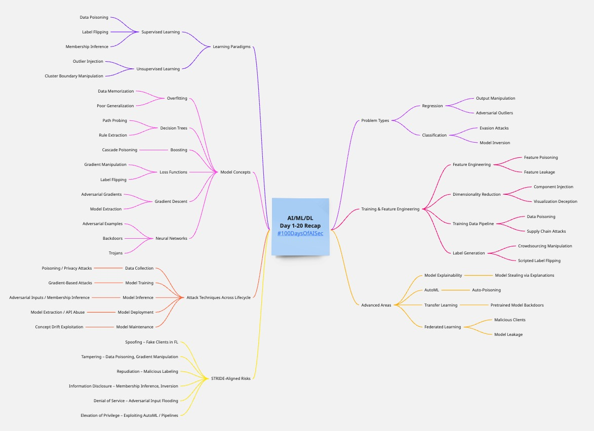

# 🔐 Threat Modeling Guide for AI/ML/DL Systems

Here’s a structured threat modeling guide for **AI/ML/DL systems** based on the core concepts we have talked in past 20 Days. This is broken down to align with pedagogical clarity and real-world security impact.

---

## I. 📊 Learning Paradigms (Supervised vs. Unsupervised Learning)

| Concept                   | Threat Vectors                                                 | Threat Description                                                                   | Impact                                        | Mitigation                                                      |
| ------------------------- | -------------------------------------------------------------- | ------------------------------------------------------------------------------------ | --------------------------------------------- | --------------------------------------------------------------- |
| **Supervised Learning**   | - Data poisoning - Label flipping - Membership inference | Attacker manipulates labels to bias model behavior. Infer if specific data was used. | Model misclassification Privacy breach     | Data validation Robust training DP (Differential Privacy) |
| **Unsupervised Learning** | - Outlier injection - Cluster boundary manipulation         | Inject anomalous data to corrupt clustering/grouping.                                | Poor clustering Faulty feature engineering | Anomaly detection Noise-tolerant algorithms                  |

---

## II. 📈 Problem Type (Regression vs. Classification)

| Type               | Threat Vectors                                  | Threat Description                                                | Impact                                 | Mitigation                                                         |
| ------------------ | ----------------------------------------------- | ----------------------------------------------------------------- | -------------------------------------- | ------------------------------------------------------------------ |
| **Regression**     | - Output manipulation - Adversarial outliers | Inject values that skew the curve drastically.                    | Bad predictions in finance/forecasting | Robust statistics Outlier detection                             |
| **Classification** | - Evasion attacks - Model inversion          | Modify input to shift to a wrong class. Extract features via API. | Fraud evasion PII leakage           | Adversarial training API rate limiting Confidence thresholds |

---

## III. 🧠 Model Concepts

| Concept                                | Threat Vectors                                            | Threat Description                                          | Impact                                  | Mitigation                                                    |
| -------------------------------------- | --------------------------------------------------------- | ----------------------------------------------------------- | --------------------------------------- | ------------------------------------------------------------- |
| **Overfitting**                        | - Model memorizes sensitive data - Poor generalization | Attacker recovers training data or causes high test error   | Privacy loss Performance degradation | Regularization Cross-validation                            |
| **Decision Trees**                     | - Path probing - Rule extraction                       | Reveal logic via output observation                         | IP theft Gaming the model            | Ensemble methods Access control                            |
| **Boosting (e.g., XGBoost, AdaBoost)** | - Cascade poisoning                                       | Poison early weak learners to propagate error               | Biased final model                      | Early stopping Data sanitization                           |
| **Loss Functions**                     | - Gradient manipulation - Label flipping               | Craft data to drive optimizer to suboptimal minima          | Inaccurate predictions                  | Robust loss functions (e.g., MAE over MSE)                    |
| **Gradient Descent**                   | - Adversarial gradients - Model extraction             | Steer model via poisoned gradients                          | Backdoors Loss of confidentiality    | DP-SGD Gradient clipping                                   |
| **Neural Networks**                    | - Adversarial examples - Backdoors - Trojans        | Minor perturbations trick model; implant malicious behavior | Model unreliability Trust violation  | Adversarial training Activation analysis Neuron pruning |

---

## IV. 🧪 Training & Feature Engineering

| Concept                                         | Threat Vectors                                            | Threat Description                                           | Impact                                          | Mitigation                                              |
| ----------------------------------------------- | --------------------------------------------------------- | ------------------------------------------------------------ | ----------------------------------------------- | ------------------------------------------------------- |
| **Feature Engineering**                         | - Feature poisoning - Feature leakage                  | Craft features to mislead the model; leak sensitive features | Model skew Privacy violations                | Feature selection audit Leakage checks               |
| **Dimensionality Reduction (e.g., PCA, t-SNE)** | - Component injection - Visualization deception        | Add noisy directions to alter embedding                      | False data interpretation Attack obfuscation | Robust PCA Manual component review                   |
| **Training Data Pipeline**                      | - Data poisoning - Supply chain attacks                | Replace or corrupt data at ingestion stage                   | Compromised training                            | Versioning Hash validation Secure pipeline        |
| **Label Generation**                            | - Crowdsourcing manipulation - Scripted label flipping | Skewed labels via malicious labelers                         | Garbage-in-garbage-out                          | Active learning Quality control Human-in-the-loop |

---

## V. ⚙️ Attack Techniques Across Lifecycle

| Phase                 | Threat Type                               | Example                                          | Mitigation                                       |
| --------------------- | ----------------------------------------- | ------------------------------------------------ | ------------------------------------------------ |
| **Data Collection**   | Poisoning / Privacy attacks               | Malicious contributors to training set           | Provenance tracking DP                        |
| **Model Training**    | Gradient-based attacks                    | Introduce poisoned gradients                     | DP-SGD Gradient clipping                      |
| **Model Inference**   | Adversarial inputs / Membership inference | Perturbed images to evade detection              | Confidence thresholds Noise-tolerant training |
| **Model Deployment**  | Model extraction / API abuse              | Black-box API probing                            | Rate limiting Access controls                 |
| **Model Maintenance** | Concept drift exploitation                | Gradual poisoning of continuously trained models | Drift detection Human audit                   |

---

## VI. 📦 Advanced Considerations

| Area                                  | Threat                             | Example                                    | Countermeasure                                  |
| ------------------------------------- | ---------------------------------- | ------------------------------------------ | ----------------------------------------------- |
| **Model Explainability (SHAP, LIME)** | Model stealing via explanations    | Output interpretation helps recreate model | Limit granularity Explainability abstraction |
| **AutoML**                            | Auto-poisoning                     | Exploiting the automation loop             | Human verification Dataset whitelisting      |
| **Transfer Learning**                 | Pretrained model backdoors         | Pretrained on poisoned corpora             | Re-train last layers Audit source            |
| **Federated Learning**                | Malicious clients Model leakage | Poisoned local updates                     | Secure aggregation Client vetting            |

---

## VII. 🔍 Prioritized Risk Assessment (STRIDE-Like)

| Threat Type                | Examples in ML Context                    | Security Property Violated |
| -------------------------- | ----------------------------------------- | -------------------------- |
| **Spoofing**               | Fake clients in federated learning        | Authentication             |
| **Tampering**              | Data poisoning, gradient manipulation     | Integrity                  |
| **Repudiation**            | Malicious labeling with no accountability | Non-repudiation            |
| **Information Disclosure** | Membership inference, model inversion     | Confidentiality            |
| **Denial of Service**      | Flooding API with adversarial inputs      | Availability               |
| **Elevation of Privilege** | Exploiting AutoML or deployment pipelines | Authorization              |

---

